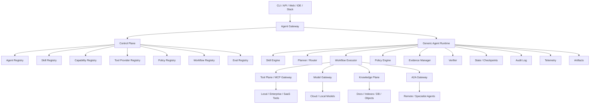

# Architecture Overview

**Audience:** Solution Architect, Technical Lead, Staff Engineer, Platform Engineer  
**Status:** Draft v1  
**Source:** [Architecture blueprint](../general_purpose_agent_platform_architecture.md)

## Architecture Thesis

Agent Foundry separates **what an agent is allowed and expected to do** from **how the runtime executes work**.

The runtime must remain domain-neutral. Domain behavior enters through:

1. Agent manifest.
2. Skill package.
3. Capability contracts.
4. Tool provider bindings.
5. Workflow definitions.
6. Policy profile.
7. Knowledge and memory scopes.
8. Model policy.
9. Eval profile.

## High-Level System



## Architectural Planes

| Plane | Responsibility |
|---|---|
| Client Plane | CLI, API, Web, IDE, chat and automation entry points |
| Control Plane | Registry, validation, versioning, publishing, governance and eval gates |
| Execution Plane | Runtime execution, workflow state, tool/model calls, approvals and outputs |
| Tool Plane | Capability resolution, MCP routing, tool auth, sanitization and audit |
| Knowledge Plane | Retrieval, indexing, ACL-aware search, citations and evidence generation |
| Model Plane | Model routing, prompt policy, redaction, caching, cost tracking and fallback |
| Governance Plane | IAM, policy, approvals, audit, compliance and security controls |
| Collaboration Plane | A2A delegation for independent remote agents |

## Control Plane vs Execution Plane

Control Plane owns definition and lifecycle:

1. Agent templates.
2. Agent manifests.
3. Skill packages.
4. Capability contracts.
5. Tool providers.
6. Policies.
7. Workflows.
8. Eval suites.
9. Release gates.

The Artifact Management Plane is the local and enterprise control-plane capability for creating, validating, publishing, versioning, deprecating and impact-analyzing these artifacts before they are used by the execution runtime.

Execution Plane owns runtime behavior:

1. Load resolved agent profile.
2. Select skills.
3. Compose context.
4. Execute workflow.
5. Propose actions.
6. Policy-check tool calls.
7. Request approvals.
8. Execute tools.
9. Create evidence.
10. Verify and persist output.

Boundary contract:

```json
{
  "agent_profile": {},
  "resolved_skills": [],
  "resolved_workflow": {},
  "effective_policy": {},
  "tool_bindings": {},
  "model_policy": {},
  "eval_profile": {}
}
```

## Core Runtime Invariants

1. Runtime must not hard-code domain-specific tool calls.
2. Every tool call must go through capability resolution.
3. Every proposed action must go through policy evaluation.
4. Write, execute and external side effects require explicit policy allowance or approval.
5. Important claims must be backed by evidence.
6. Tool results and retrieved documents must be tagged as trusted or untrusted.
7. Runtime state must be checkpointable.
8. Audit events must be emitted for security-relevant events.

## Component Responsibilities

| Component | Responsibility |
|---|---|
| Agent Gateway | Authenticated entry point for CLI/API/UI requests |
| Agent Registry | Stores agent templates, manifests and status |
| Skill Registry | Stores skill packages, lifecycle and versions |
| Capability Registry | Stores versioned contracts and compatibility rules |
| Tool Provider Registry | Stores provider metadata, auth profile and implemented capabilities |
| Policy Registry | Stores base, tenant, environment, agent and tool policies |
| Workflow Registry | Stores workflow graph definitions and state schemas |
| Eval Registry | Stores golden, safety, policy and trajectory evals |
| Artifact Management Plane | Manages artifact lifecycle, publish gates, versioning and impact analysis |
| Generic Runtime | Executes resolved agent profiles without domain hard-coding |
| Skill Engine | Loads skill instructions and selects applicable skills |
| Planner / Router | Decides next step: reason, retrieve, tool, human, agent or answer |
| Workflow Executor | Runs graph nodes and manages state transitions |
| Policy Engine | Evaluates proposed actions against effective policy |
| Evidence Manager | Creates and indexes evidence objects |
| Verifier | Checks schema, grounding, sensitivity and risk annotations |
| MCP Gateway | Routes capability calls to provider tools safely |
| Model Gateway | Routes model calls with policy, redaction and tracing |

## Architectural Decision Summary

| Decision | Rationale |
|---|---|
| Agent is composition artifact | Avoid class explosion and maximize reuse |
| Skills are first-class packages | Make operational knowledge governable and testable |
| Capability contracts abstract tools | Improve portability and compatibility validation |
| MCP is the tool integration boundary | Standardize tool discovery and invocation |
| Policy-before-action is mandatory | Prevent unsafe side effects |
| Evidence is first-class | Improve groundedness, audit and evaluation |
| A2A is deferred | Avoid early multi-agent complexity |
| Local-first MVP | Prove execution before enterprise hardening |

## Key Quality Attributes

| Attribute | Architectural mechanism |
|---|---|
| Safety | Policy engine, approval, risk classification, tool sandboxing |
| Trust | Evidence objects, claim mapping, verification |
| Reuse | Skill packages and capability contracts |
| Portability | Provider bindings behind contracts |
| Observability | Structured events, traces, audit, metrics |
| Reliability | Stateful workflow, checkpoints, retries |
| Compliance | IAM, audit, redaction, retention policy |
| Evolvability | Versioned manifests, skills, policies and capabilities |

## Architecture Anti-Patterns To Avoid

1. Adding domain conditionals to the generic runtime.
2. Letting skills call provider-specific tools directly.
3. Treating policy as prompt text.
4. Returning unsupported operational conclusions.
5. Allowing retrieved content to override system/developer instructions.
6. Shipping skills without evals.
7. Implementing A2A before single-agent runtime and tool plane are stable.
8. Mixing audit logs and debug traces into one mutable store.
