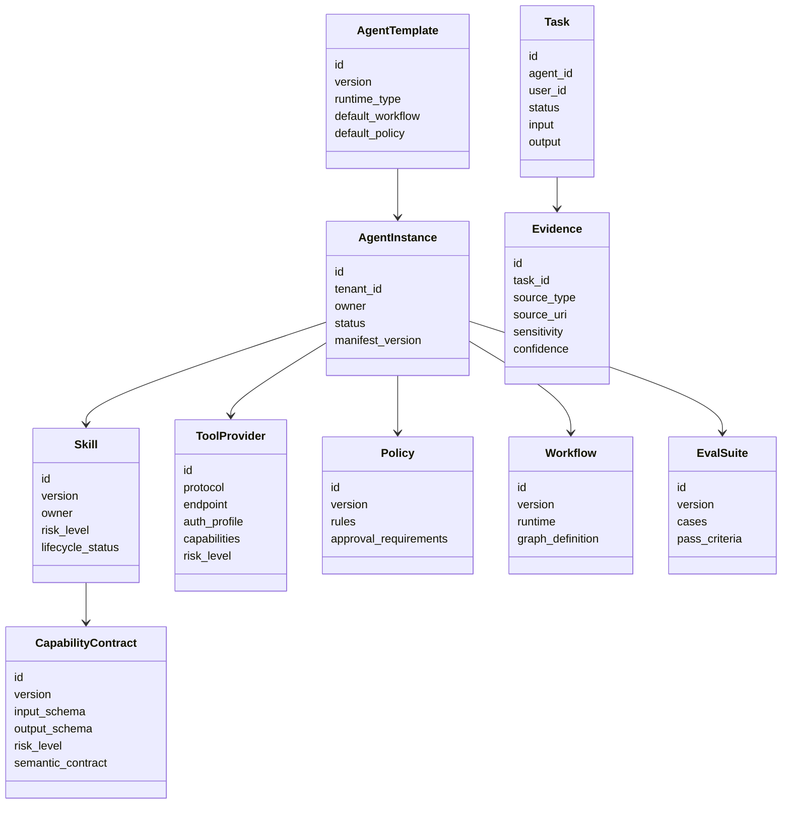

# Domain and Manifest Model

**Audience:** Solution Architect, Staff Engineer, Backend Engineer  
**Status:** Draft v1

## Domain Model Summary



## Core Entities

| Entity | Definition | Versioned | Lifecycle |
|---|---|---:|---|
| Agent Template | Reusable blueprint for a type of agent | Yes | draft, approved, deprecated |
| Agent Instance | Concrete configured agent | Yes | draft, active, suspended, archived |
| Skill | Reusable task capability package | Yes | draft, review, approved, published, deprecated, archived |
| Capability Contract | Abstract tool/data API required by skills | Yes | draft, active, deprecated |
| Tool Provider | Concrete implementation of one or more capabilities | Yes | registered, active, disabled |
| Policy | Rules for allow, deny, transform and approval | Yes | draft, active, superseded |
| Workflow | Inspectable graph/state machine | Yes | draft, active, deprecated |
| Eval Suite | Test set and pass criteria | Yes | draft, active, archived |
| Task | Runtime execution instance | No | queued, running, waiting, completed, failed, cancelled |
| Evidence | Grounding object created during execution | No | active, retained, expired |

## Agent Manifest

```yaml
apiVersion: agents.platform/v1
kind: Agent
metadata:
  id: sre-monitoring-agent
  name: SRE Monitoring Agent
  owner: sre-platform-team
  labels:
    domain: sre
    environment: production
spec:
  template: generic-task-agent@1.0.0
  purpose: Investigate production alerts and recommend safe remediation.
  skills:
    - incident-triage@1.0.0
    - metrics-analysis@1.1.0
    - log-analysis@1.2.0
  capabilityBindings:
    metrics.query@1.0: prometheus-mcp.query
    logs.search@1.0: elasticsearch-mcp.search
    traces.search@1.0: jaeger-mcp.find_traces
  knowledgeScopes:
    - service_runbooks
    - past_incidents
  memoryScopes:
    - session
    - task
  policy: production-read-mostly@2.0.0
  workflow: incident_triage_graph@1.0.0
  modelPolicy: sre-agent-model-policy@1.0.0
  evalProfile: sre-monitoring-agent-evals@1.0.0
```

## Manifest Validation Rules

Before an agent can be published, the platform must validate:

1. `apiVersion` and `kind` are supported.
2. `metadata.id`, `metadata.owner` and `spec.purpose` are present.
3. Template exists and is compatible with requested runtime.
4. Skills exist, are not deprecated and pass lifecycle requirements.
5. Skill risk levels are compatible with the agent risk profile.
6. Every required capability from selected skills is bound.
7. Bound providers implement the requested contract version.
8. Policy allows or explicitly controls required capabilities.
9. Workflow is compatible with selected runtime and state schema.
10. Knowledge scopes exist and are ACL-compatible.
11. Model policy is compatible with data sensitivity.
12. Eval suite passes or the agent is explicitly non-production.
13. Required owner/security approvals are recorded.

## Effective Policy Composition

Runtime policy is the merge of multiple layers:

```text
platform base policy
+ tenant policy
+ environment policy
+ agent policy
+ skill policy hints
+ tool provider policy
+ user/session constraints
= effective runtime policy
```

Merge rules:

1. Deny rules are strongest unless an emergency break-glass policy explicitly applies.
2. More specific rules override broad allow rules.
3. Skill hints can increase risk or require approval, but cannot reduce platform or tenant restrictions.
4. User/session constraints can only narrow permissions.
5. Provider policies can require transforms such as redaction, payload limits or sandboxing.

## Artifact Versioning

Recommended version format:

```text
<artifact-id>@<major>.<minor>.<patch>
```

Compatibility guidance:

| Change | Version impact |
|---|---|
| Add optional field | Minor |
| Add required field | Major |
| Tighten policy/risk | Minor or major depending on behavior |
| Relax policy/risk | Security review required |
| Change semantic guarantee | Major |
| Deprecate provider | Patch or minor with migration note |

## Lifecycle Gates

| Artifact | Required gates before production |
|---|---|
| Agent | Manifest validation, capability validation, policy validation, eval pass, owner approval |
| Skill | Static check, security review, capability validation, golden eval, safety eval |
| Capability | Schema review, semantic review, compatibility tests, risk classification |
| Tool Provider | Auth review, sandbox review, contract compatibility test, audit behavior test |
| Policy | Rule simulation, approval routing validation, regression test |
| Workflow | State schema validation, node compatibility, checkpoint behavior, failure-path test |

## Naming Conventions

| Artifact | Convention | Example |
|---|---|---|
| Agent | domain-purpose-agent | `sre-monitoring-agent` |
| Skill | capability-purpose | `incident-triage` |
| Capability | domain.verb | `metrics.query` |
| Provider | vendor-or-system-mcp | `prometheus-mcp` |
| Policy | scope-mode | `production-read-mostly` |
| Workflow | purpose_graph | `incident_triage_graph` |
| Eval | artifact-evals | `sre-monitoring-agent-evals` |

