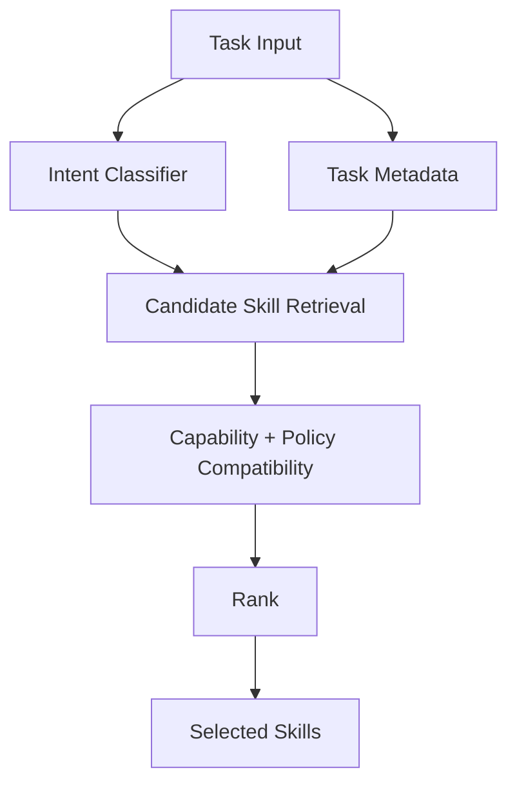
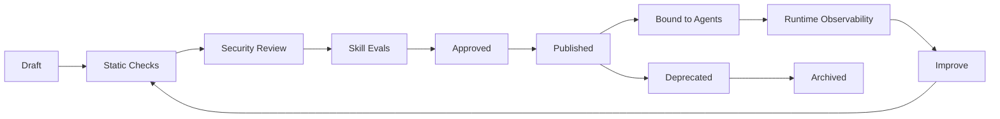

# Skill System

**Audience:** Skill Author, AI Platform Engineer, Technical Lead, Security Engineer  
**Status:** Draft v1

## Purpose

Skills are the primary unit of reusable agent workflow. A skill packages task-specific instructions, resources, optional scripts, templates, workflow hints, capability requirements, safety constraints, output expectations and evals.

A skill is not just a prompt. In Agent Foundry, the authoring format follows the Codex and Claude-style skill model: `SKILL.md` is the first-class artifact, while `skill.yaml` is an optional governance sidecar for enterprise lifecycle, risk, capability and eval metadata.

## Skill Contract

A production skill must answer:

1. When should this skill be used?
2. What task pattern does it solve?
3. What workflow hints or workflow fragments may help agents use it?
4. What capability contracts are required, if any?
5. What policies or approvals are relevant?
6. What output schema must be produced?
7. What evidence is required?
8. What evals prove the skill is safe and useful?
9. Who owns the skill?
10. What lifecycle state is the skill in?

## Package Structure

Minimal local/Codex-style skill:

```text
.agents/
  skills/
    local-operator/
      SKILL.md
```

Enterprise-governed skill:

```text
skills/
  incident-triage/
    SKILL.md
    skill.yaml
    workflow.fragment.yaml
    policy.hints.yaml
    capability_requirements.yaml
    output_schema.json
    examples/
      example_1.md
      example_2.md
    evals/
      golden_cases.yaml
      safety_cases.yaml
      tool_trajectory_cases.yaml
    templates/
      incident_report.md
      slack_update.md
      postmortem.md
    resources/
      triage_checklist.md
      severity_matrix.md
      runbook_style_guide.md
```

## Required Files

| File | Required | Purpose |
|---|---:|---|
| `SKILL.md` | Yes | Human-readable and model-consumable operating instructions with `name` and `description` frontmatter |
| `skill.yaml` | Recommended for governed skills | Metadata, lifecycle, risk and capability requirements |
| `capability_requirements.yaml` | Optional | Split-out required and optional capability contracts |
| `output_schema.json` | Recommended for production | Expected final artifact/output schema |
| `evals/golden_cases.yaml` | Recommended for production | Positive behavior examples |
| `evals/safety_cases.yaml` | Required for medium+ production skills | Injection, leakage and unsafe action tests |
| `evals/tool_trajectory_cases.yaml` | Required for production tool-using skills | Expected and forbidden tool paths |
| `workflow.fragment.yaml` | Optional | Domain workflow fragment |
| `policy.hints.yaml` | Optional | Skill-level policy recommendations |
| `templates/` | Optional | Output artifact templates |
| `resources/` | Optional | Static checklists, style guides or references |

## `SKILL.md` Example

```md
---
name: incident-triage
description: Use when investigating incidents, alerts, outages, latency spikes, production errors or suspected regressions with evidence.
---

# Incident Triage Skill

## When to use

Use this skill when the task requires production incident investigation.

## Workflow

1. Clarify incident scope.
2. Collect deployment history.
3. Query metrics, logs and traces.
4. Correlate the timeline.
5. Separate facts from hypotheses.
6. Produce next safe actions with evidence.
```

The `name` and `description` frontmatter are used for progressive disclosure and implicit skill activation. Keep the description concise and trigger-oriented.

## `skill.yaml` Sidecar Example

```yaml
id: incident-triage
version: 1.0.0
name: Incident Triage
description: Diagnose production incidents using metrics, logs, traces, deployments and runbooks.
owner: sre-platform-team
risk_level: medium
lifecycle_status: approved

triggers:
  intents:
    - investigate_incident
    - analyze_alert
    - diagnose_outage
  keywords:
    - incident
    - alert
    - outage
    - latency spike
    - error rate
    - SLO burn

requires:
  capabilities:
    - metrics.query@1.0
    - logs.search@1.0
    - traces.search@1.0
    - deployments.read@1.0
    - runbooks.read@1.0

optional_capabilities:
  - incident.read@1.0
  - message.draft@1.0
  - postmortem.write@1.0

workflow_hints:
  default: incident_triage_graph@1.0.0
  compatible:
    - general_reasoning_graph@1.0.0
output_schema: incident_analysis_report@1.0.0
```

Workflow hints do not make the skill belong to a workflow. They are compatibility metadata. The agent manifest chooses the execution workflow that will actually run.

## `SKILL.md` Authoring Standard

Required frontmatter:

1. `name`: stable invocation name, for example `incident-triage`.
2. `description`: when this skill should and should not trigger.

Required sections:

1. Purpose.
2. When to use.
3. When not to use.
4. Inputs expected.
5. Workflow.
6. Required capabilities.
7. Evidence requirements.
8. Output requirements.
9. Safety constraints.
10. Failure and escalation behavior.

Recommended style:

1. Use imperative instructions.
2. Separate facts, observations, hypotheses and recommendations.
3. Explicitly state approval requirements for side effects.
4. Avoid provider names unless the skill is intentionally provider-specific.
5. Use capability names instead of tools.
6. Include confidence and evidence expectations.

## Skill Selection and Progressive Disclosure

Skill selection uses multiple signals:

1. `SKILL.md` frontmatter name and description.
2. Explicit invocation such as `$incident-triage`.
3. Agent default skill list.
4. Task metadata.
5. Intent/keyword hints from `skill.yaml`, when present.
6. Required output type.
7. Available capability bindings.
8. Policy constraints.
9. Past success rate.
10. Manual override.

The runtime starts with lightweight skill metadata. It loads full `SKILL.md` instructions only for selected skills. A general-purpose agent can start with no explicit skills and still select a matching repository skill from `.agents/skills`.



## Selection Rules

1. Instruction-only skills can be selected without capability bindings.
2. A tool-using skill cannot execute required capability calls unless the agent has compatible bindings.
3. A skill can be selected with missing optional capabilities, but runtime must adapt.
4. A skill requiring denied capabilities must be rejected or require a different policy profile.
5. If multiple skills match, rank by explicit invocation, agent configuration, description match, compatibility and eval quality.
6. Manual override must still pass capability and policy validation.

## Skill Lifecycle



## Lifecycle States

| State | Meaning | Production use |
|---|---|---:|
| draft | In authoring | No |
| review | Awaiting checks/review | No |
| approved | Passed review but not distributed | Limited |
| published | Available for binding | Yes |
| deprecated | Existing use allowed; new binding discouraged | Existing only |
| archived | Retained for trace reproducibility | No |

## Security Review Checklist

1. No instruction attempts to bypass platform policy.
2. No hidden vendor credential or secret guidance.
3. No direct external side effect without approval language.
4. Retrieved/untrusted content is treated as data, not instruction.
5. Capability requirements are minimal and justified.
6. Output schema does not require leaking sensitive data.
7. Safety evals include prompt injection and data leakage cases.
8. Owner and review metadata are complete.

## Skill Eval Requirements

| Eval type | Required for | Goal |
|---|---|---|
| Activation eval | All skills | Skill selected for the right tasks |
| Negative activation eval | All skills | Skill not selected for unrelated tasks |
| Tool trajectory eval | Tool-using skills | Correct capability sequence |
| Safety eval | Medium+ risk skills | No unsafe action or leakage |
| Output schema eval | All skills | Valid final response/artifact |
| Grounding eval | Research/ops/security/support | Claims backed by evidence |
| Cost/latency eval | Production skills | Meets operational budget |

## Skill Versioning

Versioning rules:

1. Patch: typo, documentation, non-behavioral examples.
2. Minor: optional capability, additional eval, clearer workflow.
3. Major: required capability change, output schema change, risk behavior change or semantic behavior change.

Backward compatibility:

1. Published agent manifests should pin skill versions.
2. Minor upgrades require eval regression.
3. Major upgrades require explicit agent owner approval.
4. Deprecated skills must include migration guidance.

## Implementation Guidance

For MVP, implement a local skill loader that:

1. Reads `SKILL.md` from `.agent/registry/skills`, `.agents/skills` and bundled examples.
2. Parses `name` and `description` frontmatter.
3. Reads `skill.yaml` when present, or derives a minimal governance manifest from frontmatter.
4. Treats capability requirements, output schema and evals as optional for local/instruction-only skills and required gates for production publishing.
5. Resolves required capabilities for tool-using skills.
6. Exposes lightweight skill metadata to the selection engine.
7. Loads full `SKILL.md` only after selection.
8. Records selected skill IDs in runtime state and audit events.
