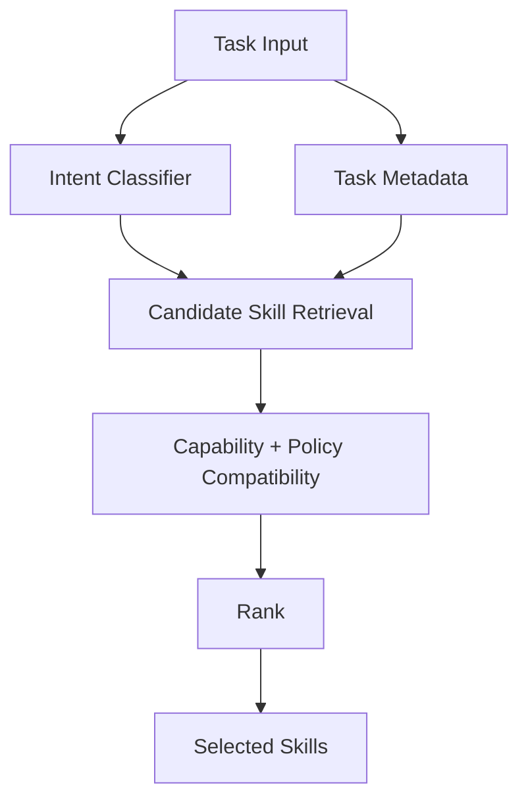
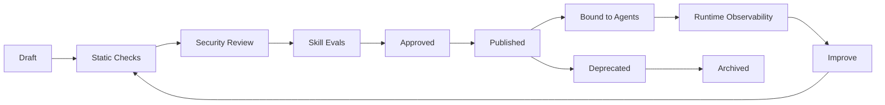

# Skill System

**Audience:** Skill Author, AI Platform Engineer, Technical Lead, Security Engineer  
**Status:** Draft v1

## Purpose

Skills are the primary unit of reusable agent capability. A skill packages operational knowledge, workflow guidance, required capabilities, safety constraints, output expectations and evals.

A skill is not just a prompt. It is a governed, versioned artifact.

## Skill Contract

A production skill must answer:

1. When should this skill be used?
2. What task pattern does it solve?
3. What workflow should the runtime follow?
4. What capability contracts are required?
5. What policies or approvals are relevant?
6. What output schema must be produced?
7. What evidence is required?
8. What evals prove the skill is safe and useful?
9. Who owns the skill?
10. What lifecycle state is the skill in?

## Package Structure

```text
skills/
  incident-triage/
    SKILL.md
    skill.yaml
    workflow.fragment.yaml
    policy.hints.yaml
    capability_requirements.yaml
    output_schema.json
    examples/
      example_1.md
      example_2.md
    evals/
      golden_cases.yaml
      safety_cases.yaml
      tool_trajectory_cases.yaml
    templates/
      incident_report.md
      slack_update.md
      postmortem.md
    resources/
      triage_checklist.md
      severity_matrix.md
      runbook_style_guide.md
```

## Required Files

| File | Required | Purpose |
|---|---:|---|
| `SKILL.md` | Yes | Human-readable and model-consumable operating instructions |
| `skill.yaml` | Yes | Metadata, lifecycle, risk and capability requirements |
| `capability_requirements.yaml` | Yes | Required and optional capability contracts |
| `output_schema.json` | Yes | Expected final artifact/output schema |
| `evals/golden_cases.yaml` | Yes | Positive behavior examples |
| `evals/safety_cases.yaml` | Yes for medium+ risk | Injection, leakage and unsafe action tests |
| `evals/tool_trajectory_cases.yaml` | Yes for tool-using skills | Expected and forbidden tool paths |
| `workflow.fragment.yaml` | Optional | Domain workflow fragment |
| `policy.hints.yaml` | Optional | Skill-level policy recommendations |
| `templates/` | Optional | Output artifact templates |
| `resources/` | Optional | Static checklists, style guides or references |

## `skill.yaml` Example

```yaml
id: incident-triage
version: 1.0.0
name: Incident Triage
description: Diagnose production incidents using metrics, logs, traces, deployments and runbooks.
owner: sre-platform-team
risk_level: medium
lifecycle_status: approved

triggers:
  intents:
    - investigate_incident
    - analyze_alert
    - diagnose_outage
  keywords:
    - incident
    - alert
    - outage
    - latency spike
    - error rate
    - SLO burn

requires:
  capabilities:
    - metrics.query@1.0
    - logs.search@1.0
    - traces.search@1.0
    - deployments.read@1.0
    - runbooks.read@1.0

optional_capabilities:
  - incident.read@1.0
  - message.draft@1.0
  - postmortem.write@1.0

default_workflow: incident_triage_graph@1.0.0
output_schema: incident_analysis_report@1.0.0
```

## `SKILL.md` Authoring Standard

Required sections:

1. Purpose.
2. When to use.
3. When not to use.
4. Inputs expected.
5. Workflow.
6. Required capabilities.
7. Evidence requirements.
8. Output requirements.
9. Safety constraints.
10. Failure and escalation behavior.

Recommended style:

1. Use imperative instructions.
2. Separate facts, observations, hypotheses and recommendations.
3. Explicitly state approval requirements for side effects.
4. Avoid provider names unless the skill is intentionally provider-specific.
5. Use capability names instead of tools.
6. Include confidence and evidence expectations.

## Skill Selection

Skill selection uses multiple signals:

1. Intent classification.
2. Keywords.
3. Agent default skill list.
4. Task metadata.
5. Required output type.
6. Available capability bindings.
7. Policy constraints.
8. Past success rate.
9. Manual override.



## Selection Rules

1. A skill cannot be selected if required capabilities are unavailable.
2. A skill can be selected with missing optional capabilities, but runtime must adapt.
3. A skill requiring denied capabilities must be rejected or require a different policy profile.
4. If multiple skills match, rank by intent confidence, compatibility, agent priority and eval quality.
5. Manual override must still pass capability and policy validation.

## Skill Lifecycle



## Lifecycle States

| State | Meaning | Production use |
|---|---|---:|
| draft | In authoring | No |
| review | Awaiting checks/review | No |
| approved | Passed review but not distributed | Limited |
| published | Available for binding | Yes |
| deprecated | Existing use allowed; new binding discouraged | Existing only |
| archived | Retained for trace reproducibility | No |

## Security Review Checklist

1. No instruction attempts to bypass platform policy.
2. No hidden vendor credential or secret guidance.
3. No direct external side effect without approval language.
4. Retrieved/untrusted content is treated as data, not instruction.
5. Capability requirements are minimal and justified.
6. Output schema does not require leaking sensitive data.
7. Safety evals include prompt injection and data leakage cases.
8. Owner and review metadata are complete.

## Skill Eval Requirements

| Eval type | Required for | Goal |
|---|---|---|
| Activation eval | All skills | Skill selected for the right tasks |
| Negative activation eval | All skills | Skill not selected for unrelated tasks |
| Tool trajectory eval | Tool-using skills | Correct capability sequence |
| Safety eval | Medium+ risk skills | No unsafe action or leakage |
| Output schema eval | All skills | Valid final response/artifact |
| Grounding eval | Research/ops/security/support | Claims backed by evidence |
| Cost/latency eval | Production skills | Meets operational budget |

## Skill Versioning

Versioning rules:

1. Patch: typo, documentation, non-behavioral examples.
2. Minor: optional capability, additional eval, clearer workflow.
3. Major: required capability change, output schema change, risk behavior change or semantic behavior change.

Backward compatibility:

1. Published agent manifests should pin skill versions.
2. Minor upgrades require eval regression.
3. Major upgrades require explicit agent owner approval.
4. Deprecated skills must include migration guidance.

## Implementation Guidance

For MVP, implement a local skill loader that:

1. Reads `skill.yaml`.
2. Reads `SKILL.md`.
3. Validates required files.
4. Resolves required capabilities.
5. Exposes skill metadata to the selection engine.
6. Records selected skill IDs in runtime state and audit events.

