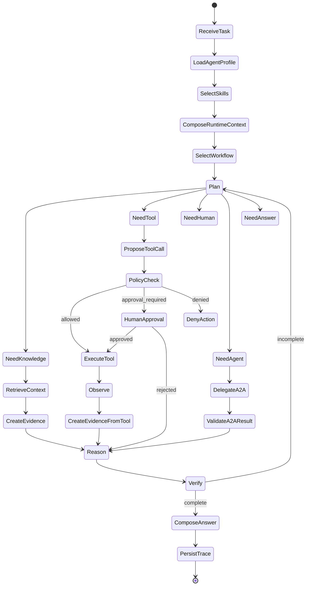

# Runtime and Workflow

**Audience:** Staff Engineer, Runtime Engineer, Technical Lead  
**Status:** Draft v1

## Purpose

The runtime executes tasks for resolved agent profiles. It must be generic, stateful, auditable and policy-aware.

The runtime does not know domain-specific business logic such as incident triage, support refund analysis or coding bugfix behavior. It executes workflows and capabilities selected by resolved agent configuration.

The local runtime supports both linear node order and explicit workflow edges.
If a workflow omits `edges`, nodes execute in manifest order for backward
compatibility. If `edges` are present, the runtime derives execution order from
the graph and checkpoints the current node index so paused tasks can resume.

## Runtime Responsibilities

1. Load resolved agent profile.
2. Load selected skills.
3. Compose runtime instructions.
4. Select workflow.
5. Maintain state and checkpoints.
6. Plan next actions.
7. Propose model/tool/human/agent steps.
8. Policy-check tool calls.
9. Request human approval.
10. Execute allowed tools.
11. Create evidence.
12. Verify output.
13. Persist audit, trace and artifacts.

## Generic Runtime State

```python
from typing import Any, TypedDict

class AgentState(TypedDict):
    task_id: str
    tenant_id: str
    user_id: str
    agent_id: str
    session_id: str
    trace_id: str

    input: str
    task_metadata: dict[str, Any]

    agent_profile: dict[str, Any]
    selected_skills: list[dict[str, Any]]
    effective_policy: dict[str, Any]
    workflow_id: str
    model_policy: dict[str, Any]

    messages: list[dict[str, Any]]
    plan: list[dict[str, Any]]
    observations: list[dict[str, Any]]
    evidence: list[dict[str, Any]]

    proposed_actions: list[dict[str, Any]]
    tool_calls: list[dict[str, Any]]
    approvals: list[dict[str, Any]]
    delegated_tasks: list[dict[str, Any]]

    intermediate_artifacts: dict[str, Any]
    final_answer: str | None
    final_artifacts: list[dict[str, Any]]

    risk_level: str
    verification_results: dict[str, Any]
    eval_results: dict[str, Any]
```

## Generic Workflow



## Workflow Types

| Workflow | Use case |
|---|---|
| `general_reasoning_graph` | Q&A, analysis, simple tasks |
| `research_graph` | Search, cite, compare, synthesize |
| `coding_task_graph` | Read code, patch, test, summarize |
| `incident_triage_graph` | Metrics, logs, traces, deployments, runbooks |
| `support_case_graph` | Ticket analysis, policy lookup, response draft |
| `security_review_graph` | Asset discovery, scans, risk scoring |
| `data_analysis_graph` | Query data, analyze, chart, report |

## Workflow Definition Example

```yaml
id: incident_triage_graph
version: 1.0.0
runtime: langgraph
state_schema: AgentState
nodes:
  - id: scope_incident
    type: llm_reasoning
  - id: collect_deployments
    type: capability_call
    capability: deployments.read@1.0
  - id: collect_metrics
    type: capability_call
    capability: metrics.query@1.0
  - id: collect_logs
    type: capability_call
    capability: logs.search@1.0
  - id: collect_traces
    type: capability_call
    capability: traces.search@1.0
  - id: correlate_timeline
    type: llm_reasoning
  - id: generate_hypotheses
    type: llm_reasoning
  - id: verify_hypotheses
    type: evaluator
  - id: recommend_remediation
    type: llm_reasoning
  - id: approval_if_needed
    type: human_approval
  - id: compose_report
    type: output_composer
```

## Node Types

| Node type | Responsibility |
|---|---|
| `llm_reasoning` | Model reasoning or synthesis |
| `capability_call` | Proposed tool/capability call with policy check |
| `knowledge_retrieval` | Retrieval through knowledge capabilities |
| `human_approval` | Pause and wait for authorized decision |
| `evaluator` | Verification, scoring or quality check |
| `router` | Conditional transition selection |
| `artifact_writer` | Persist generated artifacts |
| `output_composer` | Compose final response and artifact references |

## Checkpointing

Checkpoint after:

1. Task accepted.
2. Agent profile resolved.
3. Skills selected.
4. Tool call proposed.
5. Policy decision made.
6. Human approval requested or received.
7. Tool result observed.
8. Evidence created.
9. Final output composed.

Checkpoint must include enough state to resume without re-executing side-effecting actions.

## Human-In-The-Loop

HITL is required when policy returns:

1. `REQUIRE_APPROVAL`.
2. `REQUIRE_STEP_UP_AUTH`.
3. `REQUIRE_TRANSFORM` when transform needs human confirmation.

Approval UX must show:

1. Action.
2. Risk level.
3. Reason.
4. Evidence references.
5. Expected side effect.
6. Approver roles.
7. Timeout behavior.

## Failure Handling

| Failure | Runtime behavior |
|---|---|
| Skill not found | Fail manifest validation or request agent reconfiguration |
| Capability unavailable | Replan if optional; fail if required |
| Policy denied | Record denial and replan without the action |
| Tool timeout | Retry by provider policy; create failure observation |
| Approval rejected | Replan or produce safe alternative |
| Verification failed | Replan or return partial result with failure reason |
| Checkpoint failure | Halt task and emit operational alert |

## Runtime Anti-Patterns

1. Directly invoking vendor tools from workflow nodes.
2. Embedding production credentials into model context.
3. Letting model decide whether policy applies.
4. Treating approval as a chat message instead of a structured object.
5. Mutating external systems before checkpointing the proposed action.
6. Returning final claims without verification.

## MVP Runtime

MVP runtime should include:

1. Simple graph executor or LangGraph integration.
2. Local checkpoint store.
3. Skill selection by metadata and keyword.
4. Capability calls through an executor.
5. Policy checks for every capability call.
6. Evidence creation from tool outputs.
7. Audit event emission.
8. Final response verification against minimal schema.
