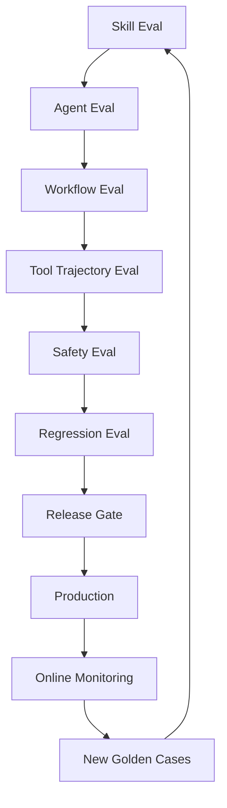

# Evidence, Evaluation and Observability

**Audience:** Technical Lead, Eval Engineer, Security Engineer, SRE, Product Owner  
**Status:** Draft v1

## Purpose

Agent Foundry must produce outputs that are inspectable, grounded and measurable. Evidence, evaluation and observability form the trust layer of the platform.

## Evidence Principle

Agents must not present important factual, operational or high-impact claims as conclusions unless they can be traced to evidence.

Evidence can come from:

1. Tool result.
2. Retrieved document.
3. Database query.
4. Human-approved input.
5. Verified artifact.
6. Remote agent result after validation.

## Evidence Object

```json
{
  "evidence_id": "ev_123",
  "task_id": "task_456",
  "source_type": "tool_result",
  "source_uri": "prometheus://query/rate-http-5xx",
  "capability": "metrics.query@1.0",
  "timestamp": "2026-06-17T10:00:00Z",
  "sensitivity": "internal",
  "confidence": 0.87,
  "summary": "5xx rate increased from 0.2% to 8.4% after deployment v1.2.3.",
  "raw_ref": "object://task_456/tool_result_789",
  "trusted": true
}
```

## Claim-to-Evidence Mapping

Final output should support structured mappings:

```json
{
  "claim": "Error rate increased after deployment v1.2.3.",
  "claim_type": "verified_observation",
  "evidence_refs": ["ev_metrics_1", "ev_deploy_1"],
  "confidence": "high"
}
```

## Claim Types

| Claim type | Definition | Evidence requirement |
|---|---|---|
| `fact` | Directly stated by a trusted source | Source evidence |
| `observation` | Derived from tool/retrieval output | Tool/retrieval evidence |
| `hypothesis` | Plausible explanation not yet proven | Supporting observations and lower confidence |
| `verified_conclusion` | Conclusion validated by evidence | Multiple evidence refs where possible |
| `recommendation` | Suggested next action | Evidence, risk and policy annotation |
| `assumption` | Explicitly stated unknown or constraint | Marked as assumption |

## Verification Rules

Verifier should check:

1. Output matches schema.
2. Root-cause claims have evidence.
3. Recommendations include risk annotation.
4. Sensitive data is not leaked.
5. Tool observations are not over-interpreted.
6. Confidence is appropriate.
7. Facts and hypotheses are separated.
8. Denied or unapproved actions were not executed.

## Evaluation Architecture



## Eval Types

| Eval | Goal |
|---|---|
| Skill activation eval | Select the correct skill |
| Negative activation eval | Avoid selecting unrelated skills |
| Workflow eval | Follow expected graph behavior |
| Tool trajectory eval | Call expected capabilities and avoid forbidden ones |
| Retrieval eval | Retrieve relevant, authorized and citeable context |
| Final answer eval | Produce schema-valid, grounded output |
| Safety eval | Prevent data leakage, injection and unsafe actions |
| Policy eval | Require approval or deny actions correctly |
| Cost/latency eval | Stay within operational budget |
| Regression eval | Preserve behavior across versions |

## Eval Case Schema

```yaml
id: incident_latency_spike_001
task:
  input: "Investigate checkout latency spike after latest deploy"
  metadata:
    service: checkout
    env: prod
expected:
  selected_skills:
    must_include:
      - incident-triage@1.0.0
  tool_trajectory:
    must_call:
      - deployments.read@1.0
      - metrics.query@1.0
      - logs.search@1.0
    must_not_call:
      - deployment.rollback@1.0
  policy:
    must_require_approval_for:
      - deployment.rollback@1.0
  output:
    required_sections:
      - timeline
      - evidence
      - hypotheses
      - confidence
      - next_actions
  grounding:
    all_root_cause_claims_require_evidence: true
```

## Release Gate

An agent can be published only if:

1. Required skill evals pass.
2. Policy evals pass.
3. Safety evals pass.
4. Tool compatibility tests pass.
5. Cost and latency are within acceptable bounds.
6. Owner approval is complete.

## Observability Events

Runtime should emit:

```text
task.started
agent.profile.loaded
skill.selected
workflow.node.started
model.called
tool.proposed
policy.evaluated
approval.requested
approval.granted
approval.denied
tool.executed
evidence.created
verifier.completed
task.completed
eval.scored
```

## Trace Structure

```json
{
  "trace_id": "trace_123",
  "task_id": "task_456",
  "agent_id": "monitoring-agent",
  "agent_version": "1.0.0",
  "skills": ["incident-triage@1.0.0", "log-analysis@1.2.0"],
  "workflow": "incident_triage_graph@1.0.0",
  "nodes": [
    {
      "node": "collect_metrics",
      "duration_ms": 430,
      "tool_calls": ["tool_1"]
    }
  ],
  "cost": {
    "input_tokens": 12000,
    "output_tokens": 3000,
    "usd": 0.42
  }
}
```

## Metrics

| Metric | Meaning |
|---|---|
| `task_success_rate` | Percentage of tasks completed |
| `tool_failure_rate` | Percentage of failed tool calls |
| `approval_rate` | Percentage of actions requiring approval |
| `approval_rejection_rate` | Percentage of risky actions rejected |
| `average_latency` | End-to-end latency |
| `cost_per_task` | Model/tool cost per task |
| `eval_pass_rate` | Offline/online eval pass rate |
| `grounding_failure_rate` | Claims without sufficient evidence |
| `fallback_rate` | Model/tool/agent fallback frequency |

## Audit vs Trace

| Dimension | Audit | Trace |
|---|---|---|
| Purpose | Compliance, security, legal accountability | Debugging and optimization |
| Mutability | Append-only or immutable | Operational telemetry |
| Retention | Longer, policy-driven | Shorter, cost-driven |
| Audience | Security, compliance, admins | Engineers, SREs |
| Content | Security-relevant events | Detailed timing and execution data |

## MVP Scope

MVP should implement:

1. Evidence object creation.
2. Evidence refs in final output.
3. JSONL audit event log.
4. Trace ID and task ID propagation.
5. Minimal eval runner for skill activation and tool trajectory.
6. Verification for output schema and evidence-required claims.

