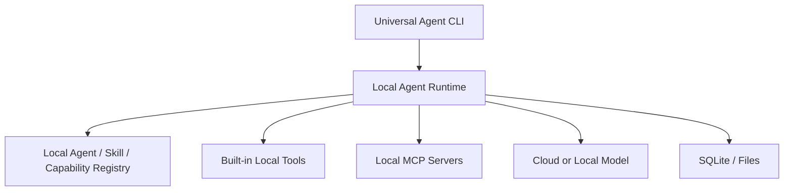
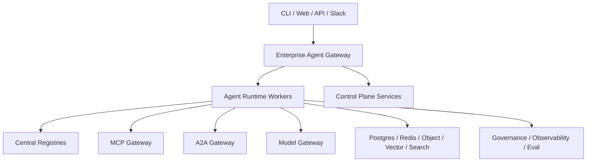
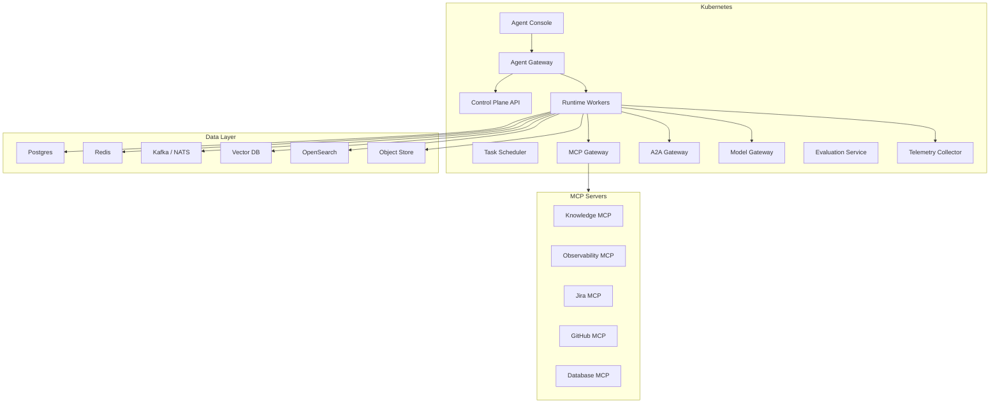

# Deployment and Operations

**Audience:** Platform Engineer, SRE, Security Engineer, Technical Lead  
**Status:** Draft v1

## Deployment Modes

Agent Foundry should support:

1. Local-first mode.
2. Team/server mode.
3. Enterprise Kubernetes mode.

## Local-First Mode

Use local-first mode for:

1. MVP development.
2. Skill authoring.
3. Local coding agents.
4. Offline or sensitive workspace tasks.
5. Developer evaluation loops.

## Enterprise Mode

Use enterprise mode for:

1. Shared agent registry.
2. Central policy and approval.
3. Multi-team operations.
4. Production integrations.
5. Compliance and audit retention.

## Kubernetes Deployment

## Isolation Strategies

| Strategy | Use case |
|---|---|
| Shared runtime, tenant-aware | Low/medium sensitivity |
| Dedicated namespace per tenant | Enterprise customers |
| Dedicated runtime pool per domain | Production/SRE/security tasks |
| Dedicated tool gateway per environment | Prod vs staging separation |
| Local-only runtime | Sensitive local development tasks |

## Operational SLOs

Initial targets:

| Service area | SLO |
|---|---|
| CLI command startup | p95 under 2 seconds excluding model/tool latency |
| Task state persistence | 99.9% successful checkpoint writes |
| Policy evaluation | p95 under 100 ms for local policy |
| Tool invocation audit | 100% audit event coverage for tool calls |
| Approval request creation | 99.9% successful for approval-required actions |
| Trace propagation | 100% tasks have trace ID |

## Runtime Runbooks

### Task Stuck Waiting for Approval

Check:

1. Approval object status.
2. Approver role mapping.
3. Notification delivery.
4. Policy rule that generated approval requirement.
5. Task checkpoint state.

Resolution:

1. Re-send approval notification.
2. Reassign approver if policy allows.
3. Cancel task if approval is no longer relevant.
4. Record administrative action in audit log.

### Tool Call Failing

Check:

1. Capability binding.
2. Provider health.
3. Auth profile.
4. Input schema validation.
5. Rate limits.
6. Network egress rules.
7. Provider output schema.

Resolution:

1. Retry if failure is transient.
2. Switch provider if capability has fallback binding.
3. Mark provider degraded.
4. Surface partial task result with failed evidence/tool observation.

### Evidence Missing From Output

Check:

1. Capability contract evidence behavior.
2. Tool output mapping.
3. Evidence manager logs.
4. Verifier result.
5. Final response composer.

Resolution:

1. Fail verification for production tasks.
2. Re-run with evidence enforcement.
3. Add eval case for regression prevention.

## Backup and Retention

| Data | Retention guidance |
|---|---|
| Agent manifests | Retain all published versions |
| Skill packages | Retain all published and bound versions |
| Audit events | Long-term, compliance-driven |
| Trace data | Shorter, cost-driven |
| Evidence summaries | Task/domain policy-driven |
| Raw tool output | Minimize retention; store by reference where possible |
| Eval results | Retain for release history |

## Deployment Promotion

Recommended environments:

1. local.
2. dev.
3. staging.
4. production.

Promotion gates:

1. Unit tests pass.
2. Contract tests pass.
3. Eval suites pass.
4. Policy simulation passes.
5. Security review complete for new high-risk capabilities.
6. Migration and rollback plan approved.

## MVP Operations

MVP operations should stay lightweight:

1. Local `.agent/` store.
2. Structured logs.
3. JSONL audit events.
4. Basic health command.
5. Basic eval report.
6. Manual approval through CLI.

