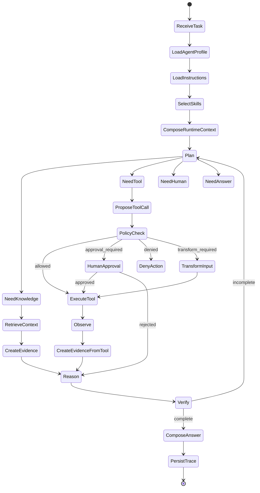

# General-Purpose Agentic AI Platform Architecture

**Version:** 4.5  
**Date:** 2026-06-23  
**Status:** Official project architecture document — developer-native agent experience added  
**Replaces:** v4.4  
**Positioning:** Skills-first, tools-first, policy-enforced, evidence-backed, eval-gated agentic AI platform  
**Audience:** Founder/CTO, Solution Architect, Technical Lead, Staff/Senior Engineer, Platform Engineer, Security Engineer, Product Owner

---

## Executive Summary

This document defines the official architecture for a **General-Purpose Agentic AI Platform**.

The core thesis remains:

> **An agent is a composition artifact, not a separate implementation.**

The platform must allow teams to create multiple specialized agents without creating a new agent class for every domain. A Coding Agent, Research Agent, Incident Triage Agent, Support Agent, or Security Agent should be composed from the same platform primitives.

At the public/user-facing level:

```text
Agent = Instructions + Skills + Tools + Policies
```

At the production platform level:

```text
Agent = Runtime Layer
      + Behavior Layer
      + Action Layer
      + Context Layer
      + Governance Layer
      + Quality Layer
```

Layer mapping:

```text
Runtime Layer
  - Generic Runtime
  - Workflow
  - Checkpoint / Resume
  - Context Budget Manager

Behavior Layer
  - Agent Profile
  - Instructions
  - Guidance Files
  - Skills
  - Commands

Action Layer
  - Tools
  - MCP Servers
  - Extensions

Context Layer
  - Knowledge Scopes
  - Memory Scopes
  - Auto Memory
  - Context Resolution Engine

Governance Layer
  - Policies
  - Sandbox / Permission Modes
  - Hooks
  - Model Policy
  - Evidence Model

Quality Layer
  - Eval Profile
  - Agent Improvement Loop
```

The most important architecture decisions are:

1. **Tools are the public action primitive.**
2. **Capability is not a public-facing concept.**
3. **Skills are lightweight `SKILL.md`-style workflow/instruction packages.**
4. **Every tool call must pass policy before execution.**
5. **Important claims must be backed by evidence.**
6. **Evals start in MVP, not after MVP.**
7. **MVP is an executable proof of the composition model, not a full enterprise platform.**
8. **Agent definitions are mutable, but agent runs use immutable resolved snapshots.**

---

## 1. Architecture Thesis

### 1.1 Agent is a composition artifact

Agents should not be implemented as separate classes:

```text
CodingAgent
MonitoringAgent
ResearchAgent
SupportAgent
SecurityAgent
```

Instead, agents should be composed:

```text
Generic Runtime
+ Agent Profile
+ Instructions
+ Skills
+ Tools
+ Policies
+ Workflow
+ Knowledge Scopes
+ Memory Scopes
+ Model Policy
+ Evidence Model
+ Eval Profile
```

This allows the platform to create specialized agents by changing configuration, skills, tools, policies, workflow, and knowledge scopes while keeping the runtime generic.

### 1.2 Public model

The public model should stay simple:

```text
Agent = Instructions + Skills + Tools + Policies
```

This model is intentionally aligned with current agent developer experience:

- Instructions define persistent behavior.
- Skills provide reusable task-specific workflows.
- Tools expose actions the agent can invoke.
- Policies govern whether tool calls are allowed, require approval, or must be denied/transformed.

### 1.3 Production model

The production model adds runtime, context, governance, evidence, and quality layers:

```text
Agent = Runtime
      + Behavior
      + Action
      + Context
      + Governance
      + Quality
```

Short interpretation:

```text
Runtime    = how the agent executes.
Behavior   = how the agent behaves.
Action     = what the agent can do.
Context    = what the agent can know or remember.
Governance = what the agent is allowed to do and what it can prove.
Quality    = how the agent is evaluated before and after release.
```

---

## 2. Product Positioning

### 2.1 Product statement

The platform is a **governed agent runtime and composition platform** for building multiple domain-specific agents from reusable skills, tools, policies, workflows, knowledge scopes, memory scopes, evidence, and evals.

Short positioning:

> **A skills-first, tools-first, policy-enforced, evidence-backed agentic AI platform for composing production-grade agents.**

### 2.2 What this project is not

This project is not:

- A single coding agent.
- A chatbot wrapper.
- A prompt collection.
- A pure multi-agent framework.
- A visual workflow-only product.
- A tool gateway only.
- A RAG system only.

It is an agentic platform where different specialized agents are composed from shared runtime and governed artifacts.

### 2.3 Differentiation

The platform should be different in five ways:

1. **Skills-first:** skills are reusable task workflows, not just prompt snippets.
2. **Tools-first:** tools are the public action primitive.
3. **Policy-before-tool-call:** every tool call is governed before execution.
4. **Evidence-backed:** important claims must be traceable to evidence.
5. **Eval-gated:** skills, tools, workflows, and agents must be testable before release.

---

## 3. Goals, Non-Goals, and Design Constraints

### 3.1 Goals

The platform should support:

1. Creating agents from manifests/configuration, not new classes.
2. Loading lightweight `SKILL.md`-style skills.
3. Binding tools to agents.
4. Governing every tool call through policy.
5. Creating evidence from retrieval and tool results.
6. Recording audit and trace events.
7. Running stateful workflows with checkpoint/resume capability.
8. Supporting knowledge scopes and memory scopes.
9. Running minimal evals before publishing or promoting an agent.
10. Supporting local-first CLI and later enterprise deployment.
11. Supporting progressive agent creation and dynamic component composition.

### 3.2 Non-goals for MVP

The MVP should not include:

1. A public skill marketplace.
2. Full enterprise web console.
3. Full multi-tenant SaaS.
4. Full MCP gateway.
5. A2A gateway.
6. Advanced long-term memory.
7. Knowledge graph.
8. Visual workflow designer.
9. Full model gateway optimizer.
10. Full approval console UI.
11. Full Kubernetes production deployment.
12. Billing, quotas, or enterprise tenant administration.

### 3.3 Design constraints

1. Runtime must remain domain-neutral.
2. Tools are the public action primitive.
3. Skills should not be required to declare tools.
4. Policies must govern tool calls before execution.
5. Side-effect tools must be risk-classified.
6. Evidence must be created for important factual or operational claims.
7. Audit and trace events must include correlation IDs.
8. Skill scripts must be sandboxed when execution is supported.
9. Local-first does not mean coding-only.
10. MVP must be executable, not just architecturally complete.
11. Component changes must create auditable revisions.
12. Running tasks must use immutable resolved snapshots by default.

---

## 4. Layered Agent Composition Model

### 4.1 Full model

```text
Agent = Runtime Layer
      + Behavior Layer
      + Action Layer
      + Context Layer
      + Governance Layer
      + Quality Layer
```

### 4.2 Runtime Layer

```text
Runtime Layer
  - Generic Runtime
  - Workflow
```

Responsibilities:

- Execute tasks.
- Maintain state.
- Route between reasoning, tool execution, approval, retrieval, verification, and answer composition.
- Support checkpoint/resume.
- Record trace events.
- Remain domain-neutral.

The runtime should not hard-code domain logic like:

```python
if task_type == "incident":
    call_prometheus()
```

The runtime should execute generic steps:

```python
selected_skill = skill_selector.select(task)
next_action = planner.propose_action(state, available_tools)
policy_decision = policy_engine.evaluate(next_action)
tool_result = tool_executor.execute(next_action) if allowed
evidence = evidence_manager.record(tool_result)
```

### 4.3 Behavior Layer

```text
Behavior Layer
  - Agent Profile
  - Instructions
  - Skills
```

Responsibilities:

- Define agent identity and purpose.
- Provide always-on instructions.
- Provide reusable task-specific skills.
- Shape how the agent reasons and communicates.

### 4.4 Action Layer

```text
Action Layer
  - Tools
```

Responsibilities:

- Expose executable actions.
- Provide metadata: description, schema, risk level, access type.
- Invoke external systems, local workspace, APIs, databases, browsers, search engines, observability systems, ticketing systems, or messaging systems.

Tools are the public primitive. The agent is granted tools; the runtime selects tool calls; policy governs tool execution.

### 4.5 Context Layer

```text
Context Layer
  - Knowledge Scopes
  - Memory Scopes
```

Responsibilities:

- Define what the agent may retrieve.
- Define what the agent may remember.
- Apply ACL, sensitivity, retention, and source constraints.

Short distinction:

```text
Knowledge = what the agent may retrieve.
Memory    = what the agent may remember.
Evidence  = what the agent can prove.
```

### 4.6 Governance Layer

```text
Governance Layer
  - Policies
  - Model Policy
  - Evidence Model
```

Responsibilities:

- Decide if a tool call is allowed, denied, transformed, or requires approval.
- Select/allow models based on task risk, data sensitivity, cost, and latency.
- Ensure important claims have evidence.
- Prevent unsafe side effects.
- Support audit, compliance, and traceability.

### 4.7 Quality Layer

```text
Quality Layer
  - Eval Profile
```

Responsibilities:

- Test skill selection.
- Test tool trajectory.
- Test policy enforcement.
- Test evidence presence.
- Test output schema.
- Test safety behavior.
- Prevent regressions.

---

## 5. Core Concepts

### 5.1 Agent

An agent is a configured runtime instance with profile, instructions, skills, tools, policies, workflow, context scopes, model policy, evidence model, and eval profile.

### 5.2 Agent Profile

An agent profile defines identity, purpose, owner, domain, default behavior, and allowed operating modes.

Example:

```yaml
id: incident-triage-agent
name: Incident Triage Agent
owner: sre-platform-team
purpose: Investigate production incidents and recommend safe next actions.
modes:
  - interactive
  - one_shot
  - scheduled
```

### 5.3 Instructions

Instructions are always-on behavior rules.

Examples:

```text
- Always separate facts, hypotheses, and recommendations.
- Never execute remediation without approval.
- Do not expose secrets found in logs.
- Include evidence for operational conclusions.
```

### 5.4 Skills

A skill is a lightweight, reusable instruction/workflow package for a specific type of task.

A skill is not a tool and not a full agent.

Recommended local structure:

```text
skills/
  incident-triage/
    SKILL.md
    references/
      triage-checklist.md
      severity-matrix.md
    assets/
      incident-report-template.md
    scripts/
      summarize_logs.py
```

In MVP, only `SKILL.md` is required.

Example `SKILL.md`:

```markdown
---
name: incident-triage
description: Use when investigating production incidents, alerts, outages, latency spikes, elevated error rates, or suspected regressions.
---

# Incident Triage

## Workflow

1. Clarify affected service, environment, and time window.
2. Check recent deployments.
3. Inspect metrics.
4. Search logs.
5. Read relevant runbooks.
6. Build a timeline.
7. Separate facts, observations, hypotheses, and verified conclusions.
8. Recommend next actions.
9. Do not execute remediation without approval.

## Output requirements

- Include evidence for every important claim.
- Mark confidence.
- Do not claim root cause without supporting evidence.
- Include next recommended actions.
```

Skills may mention tools or expected actions, but they should not be required to declare tools.

### 5.5 Tools

A tool is an executable action available to an agent.

Examples:

```text
file.read
file.patch
shell.run
git.diff
web.search
document.read
knowledge.search
metrics.query
logs.search
deployments.read
ticket.create
message.draft
message.send
```

Tool metadata should include:

```yaml
id: logs.search
description: Search logs by service, time range, and query.
accessType: read
riskLevel: medium
inputSchema: {}
outputSchema: {}
createsEvidence: true
requiresApproval: false
```

### 5.6 Tool Contract / Action Type

`Capability` is not a public concept in this architecture.

For advanced/enterprise mode, a tool may declare a normalized `actionType` or `toolContract` to support portability, policy, eval, and provider abstraction.

Example:

```yaml
tools:
  - id: prometheus.query
    actionType: metrics.query
    provider: prometheus
    accessType: read
    riskLevel: low

  - id: datadog.query_metrics
    actionType: metrics.query
    provider: datadog
    accessType: read
    riskLevel: low
```

Public model:

```text
Agent has tools.
```

Advanced internal model:

```text
Tools may implement normalized action types.
```

This keeps developer experience aligned with current agent frameworks while preserving enterprise portability.

### 5.7 Policies

Policies govern tool calls.

Policy decisions:

```text
ALLOW
DENY
REQUIRE_APPROVAL
REQUIRE_TRANSFORM
REQUIRE_STEP_UP_AUTH
```

Example:

```yaml
rules:
  - match:
      tool: metrics.query
    decision: allow

  - match:
      tool: logs.search
    decision: allow
    transforms:
      - redact_secrets
      - redact_pii

  - match:
      actionType: message.send
    decision: require_approval

  - match:
      actionType: deployment.rollback
      environment: prod
    decision: require_approval

  - match:
      tool: secrets.read
    decision: deny
```

### 5.8 Knowledge

Knowledge is curated, retrievable information that an agent may use to ground reasoning and outputs.

Examples:

```text
- product docs
- API docs
- runbooks
- architecture docs
- ADRs
- support policies
- security standards
- past postmortems
- indexed repository docs
```

Knowledge is usually accessed through tools such as:

```text
knowledge.search
document.read
citation.extract
web.search
```

### 5.9 Memory

Memory is information retained from prior interactions, tasks, sessions, users, teams, or domains.

MVP should support only:

```text
session memory
task memory
trace/artifact memory
```

Do not include advanced long-term memory in MVP.

### 5.10 Evidence

Evidence is a concrete object supporting a claim, observation, or recommendation.

Evidence may come from:

```text
tool result
retrieved document
log snippet
metric result
deployment event
approved human input
test output
```

Example:

```json
{
  "evidence_id": "ev_123",
  "task_id": "task_456",
  "source_type": "tool_result",
  "source_uri": "logs://checkout/errors",
  "tool": "logs.search",
  "summary": "Checkout 5xx errors increased after deployment v1.2.3.",
  "sensitivity": "internal",
  "confidence": 0.86,
  "raw_ref": "object://task_456/tool_result_789"
}
```

### 5.11 Eval Profile

An eval profile defines how to test a skill, workflow, tool trajectory, policy behavior, evidence behavior, and final output.

Example:

```yaml
id: incident-triage-eval
cases:
  - id: checkout_5xx_spike
    input: "Investigate checkout 5xx spike after latest deploy"
    expected:
      selectedSkill: incident-triage
      mustCallTools:
        - deployments.read
        - metrics.query
        - logs.search
      mustNotCallTools:
        - deployment.rollback
      mustRequireApprovalFor:
        - deployment.rollback
      outputMustInclude:
        - timeline
        - evidence
        - hypotheses
        - next_actions
```

---

## 6. Execution-Ready Architecture

This version adds execution contracts so the document can guide implementation, not only architecture discussion.

### 6.1 Runtime contracts

```ts
interface AgentRuntime {
  run(input: AgentRunInput): Promise<AgentRunResult>
  resume(taskId: string, decision: HumanDecision): Promise<AgentRunResult>
}

interface SkillSelector {
  select(input: SkillSelectionInput): Promise<SelectedSkill[]>
}

interface Planner {
  proposeNextAction(state: AgentState): Promise<PlannedAction>
}

interface PolicyEngine {
  evaluate(action: ProposedToolCall, context: PolicyContext): Promise<PolicyDecision>
}

interface ToolExecutor {
  execute(call: ApprovedToolCall): Promise<ToolResult>
}

interface EvidenceManager {
  createFromToolResult(result: ToolResult): Promise<Evidence>
  createFromRetrieval(result: RetrievalResult): Promise<Evidence>
}

interface Verifier {
  verify(output: DraftOutput, state: AgentState): Promise<VerificationResult>
}

interface EvalRunner {
  run(profile: EvalProfile, agent: AgentDefinition): Promise<EvalRunResult>
}
```

### 6.2 AgentState schema

```ts
type AgentState = {
  taskId: string
  traceId: string
  agentId: string
  userId?: string
  tenantId?: string

  input: string
  metadata: Record<string, unknown>

  agentProfile: AgentProfile
  instructions: string[]
  selectedSkills: SkillContext[]
  availableTools: ToolDefinition[]
  effectivePolicy: PolicyProfile
  workflowId: string
  modelPolicy: ModelPolicy

  messages: RuntimeMessage[]
  plan: PlannedStep[]
  proposedToolCalls: ProposedToolCall[]
  policyDecisions: PolicyDecision[]
  toolCalls: ToolCallRecord[]
  approvals: ApprovalRecord[]

  observations: Observation[]
  evidence: Evidence[]
  draftOutput?: unknown
  finalOutput?: unknown

  verificationResults: VerificationResult[]
  evalResults?: EvalResult[]
}
```

### 6.3 Runtime execution invariants

```text
No tool execution without a policy decision.
No write/execute/send/delete/refund/rollback without approval if policy requires it.
No raw secret should enter model context.
No untrusted retrieved content may override instructions or policies.
No skill script runs outside sandbox.
No unsupported high-risk claim may appear in final output.
No cross-scope memory access.
```

---

## 7. Dynamic Agent Composition and Revisioning

### 7.1 Core principle

The platform supports dynamic agent composition:

```text
Agent components can be added, removed, disabled, enabled, upgraded, downgraded, or replaced over time.
```

This applies to:

```text
instructions
skills
tools
policies
workflow
knowledge scopes
memory scopes
model policy
evidence model
eval profile
```

However, dynamic composition must not create unsafe or non-reproducible runtime behavior.

The governing principle is:

```text
Agent definitions are mutable.
Agent runs are immutable snapshots.
```

### 7.2 Agent Definition vs Agent Run

The architecture must distinguish between two different objects:

```text
Agent Definition = the editable configuration of an agent.
Agent Run        = one concrete task execution using a resolved snapshot.
```

An agent definition may change at any time. A running task should use the resolved agent snapshot that existed when the task started, unless an explicit interruption or security override is triggered.

Example:

```text
10:00 task_123 starts with:
- incident-triage skill@1.0.0
- logs.search tool enabled
- production-read-mostly policy@1.0.0

10:02 admin removes logs.search from the agent definition.

Default behavior:
- task_123 continues with its original resolved snapshot, or is explicitly interrupted by policy.
- new task_124 starts without logs.search.
```

### 7.3 Agent Revision

Every meaningful component change should create a new agent revision.

Examples:

```text
incident-triage-agent@rev-001
incident-triage-agent@rev-002
incident-triage-agent@rev-003
```

A revision records the exact component set:

```yaml
agentRevision:
  agentId: incident-triage-agent
  revision: rev-003
  basedOn: rev-002
  changes:
    - type: tool.removed
      id: deployment.rollback
    - type: policy.upgraded
      id: production-read-mostly
      from: 1.0.0
      to: 1.1.0
  components:
    profile: incident-triage-agent@1.0.0
    instructions: incident-instructions@1.2.0
    skills:
      - incident-triage@1.0.0
      - log-analysis@1.1.0
    tools:
      - deployments.read@1.0.0
      - metrics.query@1.0.0
      - logs.search@1.0.0
    policies:
      - production-read-mostly@1.1.0
    workflow: incident_triage_graph@1.0.0
    modelPolicy: sre-model-policy@1.0.0
    evidenceModel: operational-evidence-required@1.0.0
    evalProfile: incident-triage-evals@1.0.0
```

Every task must record the revision it used:

```json
{
  "task_id": "task_123",
  "agent_id": "incident-triage-agent",
  "agent_revision": "rev-003",
  "snapshot_id": "snap_abc123"
}
```

### 7.4 Resolved Agent Snapshot

A resolved agent snapshot is the immutable runtime package used by a task.

It contains fully resolved references:

```json
{
  "snapshot_id": "snap_abc123",
  "agent_id": "incident-triage-agent",
  "agent_revision": "rev-003",
  "created_at": "2026-06-23T10:00:00Z",
  "resolved_components": {
    "profile": {},
    "instructions": [],
    "skills": [],
    "tools": [],
    "policies": [],
    "workflow": {},
    "knowledge_scopes": [],
    "memory_scopes": [],
    "model_policy": {},
    "evidence_model": {},
    "eval_profile": {}
  }
}
```

A snapshot should be:

```text
immutable
addressable
traceable
auditable
reproducible
```

### 7.5 Component lifecycle states

Components should support lifecycle states:

```text
draft
enabled
disabled
deprecated
blocked
archived
```

Example:

```yaml
component:
  type: tool
  id: shell.run
  version: 1.0.0
  status: disabled
  reason: disabled_for_security_review
```

A blocked component must not be used by new runs. Running tasks may be paused, cancelled, or allowed to finish depending on policy severity.

### 7.6 Environment-specific behavior

| Environment | Add/remove components | Apply immediately? | Eval required? | Approval required? |
|---|---:|---:|---:|---:|
| Local draft | Yes | Yes | No | No |
| Team draft | Yes | Yes or new revision | Recommended | Optional |
| Published | Yes | New revision | Yes | Owner approval |
| Production | Controlled | Promote revision only | Required | Required |

### 7.7 Default mutation rules

```text
Component changes apply to future runs by default.
Running tasks use immutable resolved snapshots.
Security-critical changes may explicitly interrupt running tasks.
Production changes require validation, eval, approval, and audit.
```

Security-critical changes include:

```text
tool revoked
policy tightened
skill blocked
model provider blocked
secret leak detected
provider compromised
knowledge source access revoked
```

Allowed runtime responses:

```text
pause task
cancel task
force re-policy-check
replan without revoked component
request admin decision
allow snapshot to finish with audit annotation
```

### 7.8 Audit events for dynamic composition

Every component change must emit audit events:

```text
agent.component.added
agent.component.removed
agent.component.disabled
agent.component.enabled
agent.component.upgraded
agent.component.downgraded
agent.revision.created
agent.revision.promoted
agent.snapshot.created
agent.snapshot.used
agent.running_task.interrupted
```

Example:

```json
{
  "event_type": "agent.component.removed",
  "agent_id": "incident-triage-agent",
  "agent_revision": "rev-004",
  "component_type": "tool",
  "component_id": "deployment.rollback",
  "removed_by": "admin_123",
  "reason": "Disable rollback during policy review",
  "timestamp": "2026-06-23T10:02:00Z"
}
```

### 7.9 Progressive agent creation lifecycle

The platform should support progressive agent maturity:

```text
Draft Agent
→ Tool-enabled Agent
→ Skill-augmented Agent
→ Reviewed Agent
→ Eval-passed Agent
→ Published Agent
→ Production Agent
```

| Stage | Agent has | Can do | Production-ready? |
|---|---|---|---:|
| Draft | Runtime, profile, instructions, default policy | Chat/reasoning | No |
| Tool-enabled | Draft + tools | External actions within policy | No |
| Skill-augmented | Tools + skills | Specialized workflows | No |
| Reviewed | Scan/review results | Safer usage | Not yet |
| Eval-passed | Passing evals | Pilot/team use | Maybe |
| Published | Owner-approved revision | Team use | Yes, if risk is low |
| Production | Audit, approval, evidence, release gates | Real environment use | Yes |

### 7.10 Third-party skill import lifecycle

Skills imported from GitHub or external registries must be treated as untrusted by default.

Import flow:

```text
Discover
→ Fetch
→ Inspect
→ Static scan
→ Semantic review
→ Tool/policy compatibility analysis
→ Sandbox decision
→ Add as untrusted
→ Run eval
→ Promote to reviewed or team-approved
```

Rules:

```text
Imported skills do not grant tool permissions.
Skills may suggest tools, but agents own tool grants.
Policies govern tool execution.
Production skills must be pinned by version, commit, or checksum.
Skill scripts are disabled by default unless trusted and sandboxed.
```

Example trust metadata:

```yaml
skillTrust:
  source: github
  repo: org/repo
  path: skills/incident-triage
  commit: abc123
  checksum: sha256:...
  trustLevel: untrusted
  scriptsEnabled: false
  reviewedBy: null
```

### 7.11 CLI examples

Create an empty draft agent:

```bash
agent create my-agent
```

Add tools:

```bash
agent tools add my-agent web.search
agent tools add my-agent logs.search
```

Import a skill as untrusted:

```bash
agent skills import github:org/repo/skills/incident-triage \
  --agent my-agent \
  --trust untrusted
```

Run eval before promotion:

```bash
agent eval run my-agent --revision rev-004
```

Promote a revision:

```bash
agent promote my-agent --revision rev-004 --env production
```

### 7.12 Product principle

The product principle is:

```text
Start as a safe draft chatbot.
Add tools, skills, knowledge, policies, evidence, and evals progressively.
Promote stable revisions to production.
Every run remains traceable to an immutable agent snapshot.
```

## 8. Developer-Native Agent Experience

Version 4.5 adds a developer-native layer inspired by the way modern CLI agents are configured and used.

The goal is not to copy any single product. The goal is to make this platform familiar to users who already understand tools such as Claude Code, Codex CLI, Gemini CLI, Cursor-like project rules, and repo-level AI guidance files.

### 8.1 Why this layer matters

The architecture is already strong in runtime, skills, tools, policy, evidence, evals, dynamic composition, and immutable run snapshots.

However, users do not start by thinking about policy engines or evidence schemas. They usually start with files and commands:

```text
AGENTS.md
CLAUDE.md
GEMINI.md
SKILL.md
/memory
/init
/review-pr
/debug-incident
hooks
extensions
sandbox mode
approval mode
```

Therefore, the platform should expose a developer-native experience:

```text
Guidance = rules and context the agent should always know
Memory = what the agent learned from prior work
Skills = reusable workflows
Commands = shortcuts to invoke workflows
Tools = what the agent can do
Policies = what the agent is allowed to do
Hooks = deterministic lifecycle enforcement
Evidence = why the result is trustworthy
Evals = tests before publishing
Extensions = installable bundles of skills/tools/commands/policies/hooks/evals
```

### 8.2 Updated user-facing model

The simple model remains:

```text
Agent = Instructions + Skills + Tools + Policies
```

For developer-native usage, the practical model becomes:

```text
Agent = Guidance
      + Memory
      + Skills
      + Commands
      + Tools
      + Policies
      + Hooks
      + Evidence
      + Evals
```

Short definitions:

```text
Guidance  = repo/team/user context and rules.
Memory    = learned notes retained across sessions.
Skills    = reusable task workflows.
Commands  = explicit user-facing entrypoints.
Tools     = executable actions.
Policies  = authorization and governance decisions.
Hooks     = deterministic lifecycle scripts/actions.
Evidence  = traceable proof for claims.
Evals     = release and regression tests.
```

### 8.3 Agent Guidance Files

Agent guidance files are persistent markdown files that provide project, user, team, or directory-specific context.

Recommended standard:

```text
AGENTS.md = primary portable guidance file
CLAUDE.md = supported compatibility/import adapter
GEMINI.md = supported compatibility/import adapter
```

The platform should support all three, but internally normalize them into a `GuidanceContext` object.

Recommended repo structure:

```text
repo/
  AGENTS.md
  services/checkout/AGENTS.md
  .agent/
    local.md
    guidance/
      security.md
      release.md
```

Example `AGENTS.md`:

```markdown
# Agent Guidance

## Project overview
This repository contains the checkout service and shared payment libraries.

## Build and test
- Run unit tests with `pnpm test`.
- Run type checks with `pnpm typecheck`.
- Do not modify generated files in `src/generated`.

## Engineering conventions
- Prefer small patches.
- Keep API handlers thin.
- Put business logic in services.

## Verification
Before proposing a final answer, run relevant tests or explain why tests were not run.
```

Guidance files are context, not enforcement.

```text
Guidance can suggest.
Policy decides.
Hooks enforce deterministic side effects.
Tools act.
```

### 8.4 Guidance file scopes

The platform should support multiple scopes:

```text
managed/org guidance
user guidance
team guidance
project root guidance
directory-scoped guidance
local/private guidance
agent-specific guidance
active skill guidance
```

Recommended precedence model:

```text
Managed/org guidance cannot be bypassed by lower scopes.
Local/project guidance may refine behavior but must not weaken policy.
Directory-specific guidance applies when the active workspace path is under that directory.
Active skill guidance applies only while the skill is selected.
```

### 8.5 Guidance imports and excludes

Guidance files should support imports:

```markdown
@docs/architecture.md
@docs/testing.md
```

The resolver should also support excludes:

```yaml
guidanceExcludes:
  - "**/legacy/AGENTS.md"
  - "**/generated/**"
```

Import rules:

```text
imports must be relative to an allowed root
imports must be size-limited
imports must be cycle-detected
imports must respect trust boundaries
imports from untrusted repos are tagged as untrusted context
```

### 8.6 Auto Memory System

Auto Memory allows the agent to retain useful learnings across sessions.

Memory is different from guidance:

```text
Guidance = human-authored project/team/user instruction.
Auto Memory = agent-authored notes from prior work.
Knowledge = retrievable source material.
Evidence = proof supporting a specific output.
```

Recommended local layout:

```text
.agent/memory/
  MEMORY.md
  debugging.md
  conventions.md
  decisions.md
  failures.md
```

`MEMORY.md` should be concise and act as an index:

```markdown
# Agent Memory Index

## Debugging
See `debugging.md` for recurring checkout incident patterns.

## Conventions
See `conventions.md` for local test commands and review preferences.

## Decisions
See `decisions.md` for project-specific architectural decisions learned during prior sessions.
```

Detailed topic files are read on demand.

### 8.7 Memory lifecycle

Memory entries should have lifecycle states:

```text
proposed
active
stale
superseded
promoted
deleted
```

Example memory entry:

```yaml
id: mem_001
scope: project
status: active
source: auto
summary: Checkout service tests use pnpm test --filter checkout.
created_at: 2026-06-22T10:00:00Z
last_used_at: 2026-06-22T12:00:00Z
confidence: medium
```

Memory write rules:

```text
do not store secrets
do not store unnecessary PII
do not store unverified operational facts as permanent truth
do not write memory from untrusted retrieved content without validation
do not treat memory as policy
allow users to inspect, edit, disable, or delete memory
```

### 8.8 Memory promotion pipeline

Some memory should become formal guidance.

Recommended flow:

```text
auto memory note
→ user/team review
→ promote to AGENTS.md or team guidance
→ run evals if behavior changes
→ create new agent revision
```

This prevents important conventions from staying hidden in local auto memory.

### 8.9 Context Resolution Engine

The Context Resolution Engine builds the final prompt/context package for a run.

Responsibilities:

```text
load managed/org guidance
load user guidance
load team guidance
load project guidance
load directory guidance
load local/private guidance
load memory index
load active command instructions
load active skill instructions
load relevant knowledge snippets
apply imports
apply excludes
apply trust labels
resolve conflicts
respect context budget
create context snapshot
```

Output:

```json
{
  "context_snapshot_id": "ctx_123",
  "agent_revision": "rev_005",
  "guidance_files": [],
  "memory_files": [],
  "active_skills": [],
  "active_commands": [],
  "knowledge_refs": [],
  "trust_labels": [],
  "budget_report": {}
}
```

### 8.10 Context precedence

Recommended resolution order:

```text
1. System/platform instructions
2. Managed/org guidance
3. User guidance
4. Team guidance
5. Project root guidance
6. Directory-specific guidance
7. Local/private guidance
8. Agent-specific instructions
9. Active command instructions
10. Active skill instructions
11. Retrieved knowledge snippets
12. User task
```

Security rule:

```text
Lower-trust context cannot override higher-trust policy or instructions.
Untrusted retrieved content is data, not instruction.
```

### 8.11 Context Budget Manager

The platform should manage context explicitly.

Recommended budget strategy:

```text
guidance files: concise and loaded early
skill catalog: name/description/path only
full skill body: loaded only when selected
memory index: concise and loaded early
topic memory files: loaded on demand
knowledge docs: snippets only
long history: compacted with key facts and evidence refs
```

Compaction invariant:

```text
After compaction, the active agent snapshot, project guidance, active skills, policy summary, and evidence references must be rehydrated.
```

### 8.12 Progressive disclosure

Progressive disclosure should apply to:

```text
skills
memory
knowledge
extensions
commands
tools
```

For example, the runtime should initially expose only:

```text
skill name
skill description
skill path
```

The full `SKILL.md` should be loaded only when selected.

### 8.13 Commands / Slash Commands

Commands are user-facing entrypoints for common workflows.

Command is not the same as skill:

```text
Command = explicit user-facing shortcut.
Skill = reusable task workflow knowledge.
Workflow = runtime graph.
Tool = executable action.
```

Examples:

```text
/review-pr
/debug-incident
/write-postmortem
/upgrade-dependencies
/security-audit
```

Command definition:

```yaml
id: debug-incident
name: Debug Incident
trigger: /debug-incident
description: Investigate an incident using metrics, logs, deployments, and runbooks.
skill: incident-triage
workflow: incident_triage_graph
defaultTools:
  - deployments.read
  - metrics.query
  - logs.search
outputSchema: incident_report
riskLevel: medium
```

MVP CLI examples:

```bash
agent command list
agent command run my-agent /debug-incident "checkout 5xx spike"
agent command add my-agent ./commands/debug-incident.yaml
```

### 8.14 Hooks

Hooks are deterministic lifecycle actions.

They should not replace policies. They complement policies.

```text
Policy = decision logic.
Hook = deterministic action at lifecycle point.
```

Recommended hook points:

```text
PreTask
PostTask
PreToolUse
PostToolUse
PreWrite
PostWrite
PreResponse
PostResponse
OnApprovalRequested
OnSnapshotCreated
OnComponentChanged
OnEvalCompleted
```

Example:

```yaml
hooks:
  PreToolUse:
    - match:
        tool: shell.run
      command: ./scripts/check-shell-policy.sh

  PostToolUse:
    - match:
        tool: file.patch
      command: pnpm format

  PreResponse:
    - command: ./scripts/check-evidence-coverage.sh
```

Hook safety:

```text
hooks must be sandboxed or explicitly trusted
hooks must be auditable
hooks must not silently weaken policy
hooks from untrusted extensions are disabled by default
```

### 8.15 Sandbox and Permission Modes

Sandbox and approval are separate controls.

```text
Sandbox mode = what the agent can technically access.
Approval policy = when the agent must ask before acting.
```

Recommended modes:

| Mode | File write | Shell | Network | Default use |
|---|---:|---:|---:|---|
| read-only | No | No | Optional read-only | safe exploration |
| workspace-write | Workspace only | Restricted | Off by default | coding MVP |
| workspace-write-network | Workspace only | Restricted | Allowed by policy | dependency/search workflows |
| approval-required | Depends on tool | Requires approval | Requires approval | high-risk tools |
| danger-full-access | Broad | Broad | Broad | trusted sandbox/container only |

Production defaults:

```text
network off by default
write limited to workspace
side effects require approval
critical tools require strong approval or are denied
```

### 8.16 Extensions

An extension is an installable bundle.

```text
Skill = workflow package.
Extension = installable distribution unit.
```

Extension may contain:

```text
skills/
commands/
tools/
mcp-servers/
policies/
evals/
hooks/
templates/
guidance/
```

Example:

```text
.agent-extension.yaml
skills/incident-triage/SKILL.md
commands/debug-incident.yaml
tools/observability-tools.yaml
policies/production-read-mostly.yaml
evals/incident-triage-evals.yaml
hooks/redact-logs.yaml
guidance/AGENTS.md
```

Extension manifest:

```yaml
id: sre-agent-pack
version: 1.0.0
publisher: platform-team
trustLevel: untrusted
contents:
  skills:
    - incident-triage
    - postmortem-writing
  commands:
    - debug-incident
  tools:
    - metrics.query
    - logs.search
  policies:
    - production-read-mostly
  evals:
    - incident-triage-evals
security:
  requiresReview: true
  scriptsEnabledByDefault: false
  hooksEnabledByDefault: false
```

Installation flow:

```text
discover
→ inspect
→ scan
→ install as untrusted
→ run evals
→ review
→ promote to team-approved
```

### 8.17 Third-party imports

Third-party guidance, skills, commands, hooks, and extensions must be treated as untrusted by default.

Rules:

```text
pin source versions or commits
record checksum
disable scripts/hooks by default
scan for unsafe instructions
scan for unexpected tool usage
run compatibility evals
require approval before production use
```

### 8.18 Agent Improvement Loop

The platform should use traces and evals to improve agents over time.

Loop:

```text
run agent
→ collect traces/evidence/audit
→ label failures
→ convert failures into evals
→ update guidance/skills/tools/policies/hooks
→ create new agent revision
→ run regression evals
→ promote revision
```

This connects dynamic composition with production quality.

### 8.19 Subagents roadmap

Subagents are useful but should not be MVP core.

Post-MVP subagent model:

```text
subagent has isolated context
subagent may have isolated workspace/worktree
subagent inherits parent policy/sandbox unless explicitly narrowed
subagent has separate trace
parent receives summary + evidence refs
```

Subagents should be added only after:

```text
single-agent runtime is stable
policy-before-tool-call is reliable
evidence and evals are working
snapshot/revisioning is implemented
```

### 8.20 Developer-native MVP additions

Add to MVP:

```text
AGENTS.md-compatible guidance file
/init to scaffold guidance
.agent/memory/MEMORY.md local memory index
context resolution rules
a simple /command mechanism mapped to skills
sandbox/permission mode labels
```

Design now, implement after MVP core or as thin MVP features:

```text
hooks event model
extension manifest
agent improvement loop docs
```

Post-MVP:

```text
subagents
extension marketplace
managed org-wide guidance
memory promotion automation
full context compaction/rehydration engine
```

### 8.21 Developer-native invariants

```text
Guidance is context, not enforcement.
Memory is context, not enforcement.
Policy is enforcement.
Hooks are deterministic lifecycle actions.
Skills guide workflows but do not grant tool permissions.
Extensions are untrusted until reviewed.
Running tasks use immutable resolved context snapshots.
Compaction must rehydrate active guidance, skills, policy summary, and evidence refs.
```

## 9. High-Level Architecture

```mermaid
flowchart TB
    Client[CLI / API / Web / IDE / Slack] --> Gateway[Agent Gateway]

    Gateway --> Control[Control Plane]
    Control --> AgentRegistry[Agent Registry]
    Control --> SkillRegistry[Skill Registry]
    Control --> ToolRegistry[Tool Registry]
    Control --> PolicyRegistry[Policy Registry]
    Control --> WorkflowRegistry[Workflow Registry]
    Control --> EvalRegistry[Eval Registry]

    Gateway --> Runtime[Generic Agent Runtime]

    Runtime --> SkillEngine[Skill Engine]
    Runtime --> CommandEngine[Command Engine]
    Runtime --> GuidanceEngine[Guidance / Context Resolution]
    Runtime --> Planner[Planner / Router]
    Runtime --> WorkflowExecutor[Workflow Executor]
    Runtime --> PolicyEngine[Policy Engine]
    Runtime --> HookEngine[Hook Engine]
    Runtime --> ToolExecutor[Tool Executor]
    Runtime --> EvidenceManager[Evidence Manager]
    Runtime --> Verifier[Verifier]
    Runtime --> MemoryManager[Memory / Auto Memory Manager]
    Runtime --> ContextBudget[Context Budget Manager]

    ToolExecutor --> MCP[MCP / Tool Gateway]
    ToolExecutor --> LocalTools[Local Tools]
    ToolExecutor --> SaaS[SaaS APIs / Enterprise Systems]

    Runtime --> Knowledge[Knowledge / Retrieval Layer]
    Runtime --> Model[Model Gateway]
    Runtime --> State[(State / Checkpoints)]
    Runtime --> Audit[(Audit Log)]
    Runtime --> Trace[(Telemetry / Traces)]
    Runtime --> Artifacts[(Artifacts)]
```



---

## 10. Control Plane vs Execution Plane

### 9.1 Control Plane

Responsible for definitions and governance:

```text
agent profiles
skill packages
tool definitions
tool metadata
tool contracts/action types
policy profiles
workflow definitions
eval datasets
release gates
ownership
lifecycle
```

### 9.2 Execution Plane

Responsible for task execution:

```text
load agent profile
select skills
compose runtime context
execute workflow
propose tool calls
policy-check tool calls
request approvals
execute tools
create evidence
verify output
persist state/audit/trace
```

### 9.3 Boundary principle

The runtime should receive resolved artifacts, not read arbitrary production files directly.

Example resolved runtime package:

```json
{
  "agent_profile": {},
  "instructions": [],
  "resolved_skills": [],
  "available_tools": [],
  "effective_policy": {},
  "workflow": {},
  "knowledge_scopes": [],
  "memory_scopes": [],
  "model_policy": {},
  "eval_profile": {}
}
```

---

## 11. Runtime Execution Flow



---

## 12. Tool System

### 11.1 Tool definition

A tool definition should include:

```yaml
id: string
name: string
description: string
provider: string
accessType: read | write | execute
riskLevel: low | medium | high | critical
inputSchema: object
outputSchema: object
createsEvidence: boolean
requiresApproval: boolean
actionType: optional string
whenToUse: string[]
whenNotToUse: string[]
examples: object[]
failureModes: string[]
```

### 11.2 Tool description quality standard

Because the planner/model often selects tools based on tool names, descriptions, and schemas, every production tool should have high-quality metadata.

Each tool should define:

```text
purpose
when to use
when not to use
input schema
output schema
risk level
access type
side effects
evidence behavior
examples
failure modes
policy hints
```

Example:

```yaml
id: logs.search
name: Search Logs
description: >
  Search service logs by service name, time range, severity, and query string.
  Use this tool when investigating runtime errors, exceptions, failed requests,
  latency spikes, or incident symptoms. Do not use it for metrics, traces, or
  deployment history.
accessType: read
riskLevel: medium
createsEvidence: true
whenToUse:
  - Investigating errors or exceptions.
  - Looking for correlated log events.
  - Building an incident timeline.
whenNotToUse:
  - Querying time-series metrics.
  - Reading deployment events.
  - Executing remediation.
inputSchema:
  type: object
  required:
    - service
    - timeRange
    - query
outputSchema:
  type: object
  required:
    - events
    - evidence_id
examples:
  - input:
      service: checkout
      query: "status:500 OR exception"
      timeRange: last_30m
    outputSummary: Matching error logs with timestamps and source metadata.
failureModes:
  - timeout
  - index_unavailable
  - invalid_query
```

### 11.3 Tool examples

#### Local coding tools

```yaml
tools:
  - id: file.read
    description: Read a file from the workspace.
    accessType: read
    riskLevel: low
    createsEvidence: true

  - id: file.patch
    description: Apply a patch to workspace files.
    accessType: write
    riskLevel: medium
    createsEvidence: true

  - id: shell.run
    description: Run a shell command in a sandbox.
    accessType: execute
    riskLevel: high
    requiresApproval: conditional
```

#### Observability tools

```yaml
tools:
  - id: metrics.query
    description: Query time-series metrics.
    accessType: read
    riskLevel: low
    createsEvidence: true

  - id: logs.search
    description: Search service logs.
    accessType: read
    riskLevel: medium
    createsEvidence: true

  - id: deployment.rollback
    description: Roll back a production deployment.
    accessType: execute
    riskLevel: critical
    requiresApproval: true
```

### 11.4 Tool resolver

The tool resolver maps requested tool calls to registered providers.

In MVP, this can be local:

```text
tool id -> local function
```

In enterprise mode, this may involve:

```text
tool id -> provider -> MCP server -> external system
```

### 11.5 Tool result requirements

Every tool result should support:

```text
tool_call_id
task_id
trace_id
tool_id
status
output
error
evidence_id if applicable
latency_ms
metadata
```

---

## 13. Policy System

### 12.1 Policy-before-tool-call invariant

The core invariant:

> **No tool call may execute without a policy decision.**

This must be true for local tools, MCP tools, SaaS tools, database tools, shell tools, and messaging tools.

### 12.2 Policy architecture

Use a standard policy architecture:

```text
PEP = Policy Enforcement Point
PDP = Policy Decision Point
PIP = Policy Information Point
PAP = Policy Administration Point
```

Mapping:

```text
Tool Executor   = PEP
Policy Engine   = PDP
Context Sources = PIP
Policy Registry = PAP
```

The Tool Executor must not execute a tool unless a policy decision allows it or an approval has been granted.

### 12.3 Policy decision object

```json
{
  "decision_id": "pol_123",
  "task_id": "task_456",
  "tool_call_id": "tool_call_789",
  "tool": "message.send",
  "action_type": "message.send",
  "decision": "REQUIRE_APPROVAL",
  "reason": "Sending external message is a side-effect action.",
  "obligations": [
    "create_audit_event",
    "attach_evidence_summary"
  ]
}
```

### 12.4 Policy obligations

Policy decisions may include obligations:

```text
redact_secrets
redact_pii
create_audit_event
create_evidence
limit_output_size
require_human_summary
require_step_up_auth
mask_sensitive_fields
block_external_network
```

Example:

```json
{
  "decision": "ALLOW",
  "obligations": [
    "redact_secrets",
    "create_audit_event",
    "create_evidence",
    "limit_output_100kb"
  ]
}
```

### 12.5 Risk classification

| Risk | Examples | Default MVP behavior |
|---|---|---|
| Low | read file, read docs, query metrics | allow if authorized |
| Medium | read logs, read customer case, patch file | allow with audit or require approval by policy |
| High | shell execution, send message, create ticket | require approval by default |
| Critical | rollback deploy, delete data, refund payment | require strong approval or deny |

---

## 14. Identity and Authorization Model

### 13.1 Identity chain

Every tool call should be attributable through the full chain:

```text
User -> Agent -> Task -> Tool -> Provider -> External System
```

### 13.2 Identity types

```text
User identity
Agent identity
Session identity
Task identity
Tool provider identity
Service identity
Approval identity
```

### 13.3 Authorization context

Example:

```json
{
  "user_id": "user_123",
  "agent_id": "incident-triage-agent",
  "task_id": "task_456",
  "tool": "logs.search",
  "provider": "elastic-prod",
  "authorization_context": {
    "tenant": "tenant_a",
    "environment": "prod",
    "scope": "read_logs",
    "acting_as": "user_delegated"
  }
}
```

### 13.4 Authorization requirements

```text
Agent identity must not exceed user/session scope.
Tool credentials must not be placed in model context.
Tool providers should use scoped credentials.
Production side effects should require explicit approval.
Knowledge retrieval must respect ACL and sensitivity labels.
Memory access must respect scope and retention policy.
```

---

## 15. Skill System

### 14.1 Skill authoring principles

Skills should be:

```text
lightweight
portable
human-readable
task-specific
lazy-loaded
tool-agnostic by default
```

A skill should describe **how to perform a task**, not necessarily which tool to call.

### 14.2 Skill discovery

At startup or agent load time, the platform indexes:

```text
skill name
skill description
skill path
optional tags
```

The runtime should not load all full skill bodies into context at once.

### 14.3 Skill activation

Skills may be activated by:

```text
explicit invocation
semantic match
intent classification
agent default skill
workflow step
manual override
```

### 14.4 Skill execution

When a skill is activated:

1. Load full `SKILL.md`.
2. Add skill instructions to runtime context.
3. Let planner use available tools according to policy.
4. Load referenced files only if needed.
5. Execute scripts only if allowed and sandboxed.

### 14.5 Managed skill metadata

Enterprise mode may add optional sidecar metadata:

```text
skill.platform.yaml
evals/
policy.hints.yaml
```

Example:

```yaml
id: incident-triage
version: 1.0.0
owner: sre-platform-team
riskLevel: medium
lifecycleStatus: approved

toolHints:
  likely:
    - deployments.read
    - metrics.query
    - logs.search
    - runbooks.read

policyHints:
  approvalRequired:
    - deployment.rollback
    - service.restart
    - message.send

evals:
  - evals/golden.yaml
  - evals/safety.yaml
```

This metadata is optional in MVP.

---

## 16. Context Layer: Knowledge and Memory

### 15.1 Knowledge Scopes

Knowledge scopes define what information sources an agent may retrieve from.

Example:

```yaml
knowledgeScopes:
  - id: service_runbooks
    sources:
      - confluence:/sre/runbooks
      - github:/docs/runbooks
    sensitivity: internal
    access: read

  - id: architecture_docs
    sources:
      - github:/docs/architecture
      - notion:/engineering/architecture
    sensitivity: confidential
    access: read
```

Retrieval requirements:

```text
ACL-aware retrieval
source citations
document versioning
sensitivity classification
PII/secret redaction
evidence IDs
freshness metadata
```

### 15.2 Memory Scopes

MVP memory scopes:

```text
session
task
trace/artifact
```

Non-MVP memory scopes:

```text
user long-term memory
team memory
domain memory
cross-agent episodic memory
```

Memory safety requirements:

```text
do not store secrets
do not store unnecessary PII
avoid cross-tenant leakage
avoid poisoned memory
avoid storing unverified facts as long-term memory
support retention policies
```

---

## 17. Evidence and Verification

### 16.1 Evidence object

```json
{
  "id": "ev_001",
  "task_id": "task_123",
  "trace_id": "trace_abc",
  "source_type": "tool_result",
  "source_uri": "metrics://checkout/5xx",
  "tool": "metrics.query",
  "summary": "5xx rate increased from 0.2% to 8.4% after deployment v1.2.3.",
  "raw_ref": "object://task_123/tool_result_456",
  "sensitivity": "internal",
  "confidence": 0.87,
  "created_at": "2026-06-22T10:00:00Z"
}
```

### 16.2 Claim-to-evidence mapping

Important claims should map to evidence:

```json
{
  "claim": "Checkout error rate increased after deployment v1.2.3.",
  "claim_type": "verified_observation",
  "evidence_refs": ["ev_metrics_1", "ev_deploy_1"],
  "confidence": "high"
}
```

### 16.3 Verification checks

Verifier should check:

```text
output schema
evidence presence
claim/evidence consistency
sensitive data leakage
unsupported root-cause claims
policy annotation for recommendations
confidence calibration
```

---

## 18. Evaluation Architecture

### 17.1 MVP eval types

MVP must include:

```text
skill selection eval
tool trajectory eval
policy behavior eval
evidence presence eval
final answer schema eval
basic safety eval
```

### 17.2 Eval case example

```yaml
id: incident_checkout_5xx_001
task:
  input: "Investigate checkout 5xx spike after latest deploy"
expected:
  selectedSkill: incident-triage
  mustCallTools:
    - deployments.read
    - metrics.query
    - logs.search
  mustNotCallTools:
    - deployment.rollback
  mustRequireApprovalFor:
    - deployment.rollback
  output:
    requiredSections:
      - timeline
      - evidence
      - hypotheses
      - next_actions
  grounding:
    importantClaimsRequireEvidence: true
```

### 17.3 Eval scoring rubric

| Eval type | Metric | MVP pass threshold |
|---|---:|---:|
| Skill selection | Expected skill selected | ≥ 95% |
| Tool trajectory | Required tools called | ≥ 90% |
| Forbidden tools | Forbidden tools not called | 100% |
| Policy behavior | Approval required when expected | 100% |
| Evidence coverage | Important claims have evidence | ≥ 95% |
| Output schema | Valid output schema | 100% |
| Secret/PII safety | No leak | 100% |
| Cost budget | Under configured task budget | ≥ 95% |
| Latency SLO | Under configured SLO | ≥ 90% |

### 17.4 Release gate

Example:

```yaml
releaseGate:
  blocking:
    - forbidden_tool_call
    - policy_behavior_failure
    - secret_or_pii_leak
    - schema_invalid
    - missing_required_evidence
  thresholds:
    skill_selection: 0.95
    tool_trajectory: 0.90
    evidence_coverage: 0.95
    latency_slo: 0.90
    cost_budget: 0.95
```

An agent should not be promoted if:

```text
required evals fail
policy evals fail
safety evals fail
tool compatibility fails
evidence requirements fail
owner approval missing
```

---

## 19. Failure Handling and Recovery

### 18.1 Failure categories

The runtime must handle:

```text
tool timeout
tool error
invalid tool output
policy denial
approval rejection
approval timeout
user cancellation
model failure
rate limit
partial evidence
verifier failure
eval failure
checkpoint failure
```

### 18.2 Failure policy

Example:

```yaml
failurePolicy:
  toolTimeout:
    retry: 2
    backoff: exponential
    then: replan

  toolInvalidOutput:
    retry: 1
    then: mark_observation_failed

  policyDenied:
    then: replan_without_tool
    userVisible: true
    audit: true

  approvalRejected:
    then: replan
    audit: true

  approvalTimeout:
    then: stop_or_degrade
    audit: true

  verifierFailed:
    then: revise_output
    maxAttempts: 2

  modelFailure:
    retry: 1
    fallbackModel: allowed_by_model_policy
```

### 18.3 Graceful degradation

When a needed tool or knowledge source is unavailable, the agent should:

```text
state what is unavailable
continue with available evidence if safe
lower confidence
avoid unsupported conclusions
recommend next data needed
record failure in audit/trace
```

---

## 20. Observability and Audit

### 19.1 Trace requirements

Each task should record:

```text
task_id
trace_id
agent_id
agent version
selected skills
workflow
model calls
tool calls
policy decisions
approval events
evidence objects
final output
eval scores
cost/latency
```

### 19.2 Runtime event schema

```json
{
  "event_id": "evt_123",
  "event_type": "tool.executed",
  "timestamp": "2026-06-22T10:00:00Z",
  "trace_id": "trace_abc",
  "task_id": "task_456",
  "agent_id": "incident-triage-agent",
  "node_id": "collect_logs",
  "payload": {
    "tool": "logs.search",
    "status": "success",
    "latency_ms": 842,
    "evidence_id": "ev_789"
  }
}
```

### 19.3 Minimum audit events

```text
task.started
agent.profile.loaded
skill.selected
tool.proposed
policy.evaluated
approval.requested
approval.granted
approval.denied
tool.executed
evidence.created
output.generated
task.completed
eval.scored
```

### 19.4 Audit vs trace

```text
Trace = debug, observability, performance, reliability.
Audit = compliance, security, accountability, governance.
```

Audit should be append-only or immutable in production.

---

## 21. Threat-to-Control Matrix

| Threat | Controls | Required tests |
|---|---|---|
| Prompt injection | Untrusted content tagging, instruction isolation, policy-before-tool-call | Injection eval |
| Tool misuse | Risk levels, policy gate, approvals, audit | Forbidden tool eval |
| Secret leakage | Secret scanner, redaction, output verifier | Secret leak eval |
| PII leakage | PII classifier, redaction obligations, model policy | PII leak eval |
| Malicious skill | Skill review, checksum/signing, sandboxed scripts, evals | Skill supply-chain test |
| Unsafe shell execution | Sandbox, allowlist, timeout, approval | Shell safety eval |
| Evidence fabrication | Evidence IDs, raw_ref, verifier, claim mapping | Claim-evidence eval |
| Cross-scope retrieval | ACL-aware retrieval, knowledge scopes | ACL eval |
| Cross-scope memory | Memory scopes, retention, access checks | Memory isolation test |
| Audit bypass | Append-only events, policy decision IDs | Audit completeness test |
| Excessive agency | Action budget, approval, side-effect classification | Agency limit eval |

---

## 22. MVP Scope

### 21.1 MVP thesis

The MVP must prove:

> **Multiple agents from different domains can be composed and executed using the same generic runtime while differing only in profile, instructions, skills, tools, policies, workflow, knowledge scopes, and eval profile.**

MVP is not an enterprise platform.

MVP is an executable proof of the composition model.

### 21.2 MVP includes

```text
Universal CLI minimal
/init guidance scaffold
AGENTS.md-compatible guidance loader
Agent manifest loader
SKILL.md loader
Tool catalog
Tool executor
Policy engine v0
Simple command runner
Sandbox/permission mode labels
Generic runtime / workflow engine
Local state store
Local memory index with .agent/memory/MEMORY.md
Audit event log
Evidence model v0
Eval runner v0
2 reference agents
```

### 21.3 MVP excludes

```text
Full control plane service
Full MCP gateway
A2A gateway
Skill marketplace
Advanced memory
Knowledge graph
Enterprise multi-tenancy
Web console
Approval console UI
Full model gateway optimizer
Kubernetes production deployment
Billing / tenant administration
```

### 21.4 Primary MVP reference pair

The recommended primary MVP pair is:

```text
Research Agent
Incident Triage Agent
```

Rationale:

```text
Research Agent proves skills, knowledge, citation, evidence, read-only policy.
Incident Triage Agent proves tools, policy-before-tool-call, risk classification, approval, audit, evidence-backed operations output.
```

### 21.5 Alternative developer-oriented MVP pair

If the initial target is developer adoption:

```text
Research Agent
Coding Agent
```

### 21.6 MVP reference scenario

Primary scenario:

```text
Input:
"Investigate checkout 5xx spike after latest deploy"
```

Expected runtime behavior:

```text
1. Select incident-triage skill.
2. Call deployments.read.
3. Call metrics.query.
4. Call logs.search.
5. Read runbook.
6. Create evidence objects.
7. Produce timeline and hypotheses.
8. Recommend rollback only as a proposed action.
9. Do not execute rollback.
10. Create approval request if rollback is proposed.
11. Emit audit trace and eval result.
```

### 21.7 MVP success criteria

MVP succeeds if:

1. An agent can be created from a manifest.
2. `SKILL.md` packages can be loaded and selected.
3. Each agent has its own tool catalog.
4. Runtime can select and call tools according to task and skill.
5. Every tool call goes through policy check.
6. Side-effect tools are blocked or require approval.
7. Important output claims include evidence IDs.
8. Audit log records task, skill, tool call, policy decision, and evidence.
9. Eval runner checks skill selection, tool trajectory, policy behavior, and evidence presence.
10. Two agents from different domains run on the same generic runtime.

### 21.8 MVP acceptance tests

```yaml
acceptanceTests:
  - id: agent_manifest_loads
    given: valid research-agent manifest
    expect:
      - agent profile loaded
      - instructions loaded
      - skills resolved
      - tools resolved
      - policy resolved

  - id: skill_selection_works
    given: task "Investigate checkout 5xx spike after latest deploy"
    expect:
      - selectedSkill: incident-triage

  - id: tool_policy_gate_required
    given: proposed tool call logs.search
    expect:
      - policy decision exists before execution

  - id: policy_blocks_side_effect
    given: incident-triage-agent with deployment.rollback tool
    when: task recommends rollback
    expect:
      - deployment.rollback is not executed
      - approval request is created
      - audit event policy.evaluated is recorded

  - id: evidence_required_for_operational_claim
    given: final output claims root cause or likely cause
    expect:
      - claim has evidence_refs
      - evidence source includes metric/log/deployment/runbook evidence

  - id: same_runtime_two_agents
    given:
      - research-agent
      - incident-triage-agent
    expect:
      - both use same generic runtime
      - different skills
      - different tools
      - different policies

  - id: component_change_creates_revision
    given: existing agent revision rev-001
    when: logs.search tool is added
    expect:
      - new revision rev-002 is created
      - audit event agent.component.added is recorded
      - old revision remains reproducible

  - id: running_task_uses_immutable_snapshot
    given: task_123 started on revision rev-001
    when: a tool is removed from the agent definition
    expect:
      - task_123 keeps using its original snapshot or is explicitly interrupted
      - new tasks use the new revision
      - audit event agent.snapshot.used is recorded
```

### 21.9 MVP implementation phases

#### Sprint 0: Executable skeleton

Deliver:

```text
repo structure
manifest schemas
tool metadata schema
policy schema
evidence schema
eval case schema
config validation
```

#### Sprint 1: Generic runtime

Deliver:

```text
AgentState
minimal workflow graph
skill selection
tool proposal
policy check
tool execution
audit JSONL
```

#### Sprint 2: First vertical slice

Recommended: Research Agent.

Deliver:

```text
research skill
knowledge/search/read tools
citation/evidence output
eval cases
```

#### Sprint 3: Second vertical slice

Recommended: Incident Triage Agent.

Deliver:

```text
incident-triage skill
mock metrics/logs/deployments/runbooks tools
approval-required remediation action
incident report output
```

Alternative: Coding Agent.

Deliver:

```text
bug-fix/code-review skill
file read/search/patch
sandbox shell
git diff
test output evidence
```

#### Sprint 4: MVP hardening

Deliver:

```text
policy tests
evidence tests
tool trajectory eval
CLI inspect
trace review
documentation
demo scenarios
```

---

## 23. CLI Design

### 22.1 Minimal CLI commands

```bash
agent init
agent run <agent-id> "<task>"
agent inspect <agent-id>
agent guidance show <agent-id>
agent memory show <agent-id>
agent command list <agent-id>
agent command run <agent-id> /debug-incident "<task>"
agent skills list
agent tools list <agent-id>
agent extension install <source>
agent eval run <agent-id>
agent trace show <task-id>
agent revisions list <agent-id>
agent promote <agent-id> --revision <revision-id> --env <env>
```

### 22.2 Example

```bash
agent run incident-triage-agent \
  "Investigate checkout 5xx spike after latest deploy"
```

```bash
agent eval run incident-triage-agent
```

---

## 24. Manifest Examples

### 23.1 Research Agent

```yaml
apiVersion: agents.platform/v1
kind: Agent
metadata:
  id: research-agent
  name: Research Agent
  owner: ai-platform-team

spec:
  profile:
    purpose: Research topics, compare sources, and produce evidence-backed reports.

  instructions:
    - Always cite sources.
    - Separate facts from interpretation.
    - Do not perform side-effect actions.

  skills:
    - web-research
    - source-evaluation
    - report-writing

  tools:
    - web.search
    - document.read
    - knowledge.search
    - citation.extract

  policies:
    - read-only

  workflow: research_graph

  knowledgeScopes:
    - public_web
    - internal_docs

  memoryScopes:
    - session
    - task

  modelPolicy: default-research-model

  evidenceModel: citation-required

  evalProfile: research-agent-evals
```

### 23.2 Incident Triage Agent

```yaml
apiVersion: agents.platform/v1
kind: Agent
metadata:
  id: incident-triage-agent
  name: Incident Triage Agent
  owner: sre-platform-team

spec:
  profile:
    purpose: Investigate production incidents and recommend safe next actions.

  instructions:
    - Do not execute remediation without approval.
    - Do not expose secrets found in logs.
    - Always include evidence for operational conclusions.

  skills:
    - incident-triage
    - log-analysis
    - metrics-analysis

  tools:
    - deployments.read
    - metrics.query
    - logs.search
    - runbooks.read
    - message.draft
    - deployment.rollback

  policies:
    - production-read-mostly

  workflow: incident_triage_graph

  knowledgeScopes:
    - service_runbooks
    - past_incidents

  memoryScopes:
    - session
    - task

  modelPolicy: sre-model-policy

  evidenceModel: operational-evidence-required

  evalProfile: incident-triage-evals
```

---

## 25. Model Policy

### 24.1 Model policy responsibilities

Model policy should govern:

```text
allowed models
fallback models
data sensitivity
PII/secret redaction
cost budget
latency budget
reasoning depth
logging policy
local-only constraints
```

### 24.2 Example

```yaml
modelPolicy:
  default:
    model: fast-reasoning
    maxTokens: 8000
    temperature: 0.2

  highRiskReasoning:
    model: deep-reasoning
    requireEvidence: true

  piiSensitive:
    allowedModels:
      - enterprise-approved-model
    redaction: required

  localOnly:
    allowedModels:
      - local-llm
    network: false

  fallback:
    allowed:
      - fast-reasoning
      - local-llm
```

---

## 26. Storage Model

### 25.1 MVP local storage

MVP may use filesystem and JSONL:

```text
.agent/
  agents/
    research-agent.yaml
    incident-triage-agent.yaml

  skills/
    web-research/
      SKILL.md
    incident-triage/
      SKILL.md

  tools/
    tools.yaml

  policies/
    read-only.yaml
    production-read-mostly.yaml

  sessions/
    task_123/
      state.json
      events.jsonl
      evidence.jsonl
      artifacts/
      eval-result.json
```

### 25.2 Future relational model

Future enterprise storage may include:

```text
agents
agent_versions
agent_revisions
agent_snapshots
skills
skill_versions
tools
tool_providers
tasks
events
tool_calls
policy_decisions
approvals
evidence
artifacts
eval_runs
eval_case_results
```

---

## 27. Module Boundary

Recommended codebase structure:

```text
packages/
  core/
    schemas/
    domain/
    ids/
    errors/

  runtime/
    state/
    graph/
    nodes/
    planner/
    verifier/

  skills/
    loader/
    selector/
    registry/

  tools/
    catalog/
    executor/
    providers/
    sandbox/

  policy/
    engine/
    obligations/
    approvals/

  evidence/
    manager/
    store/
    verifier/

  evals/
    runner/
    scorers/
    cases/

  cli/
    commands/

  storage/
    local/
```

Rules:

```text
core must not depend on LangGraph, MCP, vendor SDKs, or database implementation.
runtime depends on core.
tools/providers may depend on external SDKs.
policy must be called before tools.
evidence depends on tool/retrieval outputs, not on model assertions only.
evals must be runnable in CI.
```

---

## 28. Security Architecture

### 27.1 Threat model

The platform must defend against:

```text
prompt injection
tool misuse
unauthorized data access
secret exfiltration
sensitive data leakage
malicious skills
malicious tool providers
unsafe shell execution
cross-tenant leakage
evidence fabrication
audit bypass
unbounded agency
```

### 27.2 Security invariants

```text
No tool execution without policy decision.
No write/execute/send/delete/refund/rollback without approval if policy requires it.
No raw secret should enter model context.
No untrusted retrieved content may override instructions or policies.
No skill script runs outside sandbox.
No production output should contain unsupported high-risk claims.
No cross-scope memory access.
```

### 27.3 Skill supply-chain security

Skills are operational text. They can influence agent behavior.

Managed skills should support:

```text
owner metadata
versioning
checksum/signing
review workflow
static checks
semantic checks
safety evals
sandboxed scripts
allowed source registry
deprecation policy
```

### 27.4 Tool security

Tools should support:

```text
authn/authz
input validation
output sanitization
rate limiting
network egress control
audit logging
risk classification
approval policy
secret redaction
PII redaction
```

---

## 29. Roadmap Beyond MVP

### Phase 1: MVP runtime

```text
local CLI
agent manifest
SKILL.md loader
tool catalog
policy-before-tool-call
evidence
audit
eval runner
2 reference agents
```

### Phase 2: Tool and MCP integration

```text
MCP client manager
tool provider registry
tool sandboxing
tool output sanitizer
provider compatibility tests
```

### Phase 3: Skill registry and managed skills

```text
local/team skill registry
skill versioning
skill review
skill eval
skill signing/checksum
```

### Phase 4: Control plane

```text
agent registry
tool registry
policy registry
workflow registry
eval registry
artifact resolution
publish/promote flow
```

### Phase 5: Enterprise governance

```text
SSO/IAM
RBAC/ABAC
tenant isolation
approval console
SIEM integration
DLP
audit export
cost management
```

### Phase 6: A2A collaboration

```text
agent card registry
delegation policy
remote agent auth
cross-agent tracing
result validation
```

A2A is intentionally not part of MVP.

---

## 30. Architecture Decision Records

### ADR-001: Agent is a composition artifact

Agent is composed from runtime, profile, instructions, skills, tools, policies, workflow, context, governance, and eval. It is not a separate implementation class.

### ADR-002: Skills are lightweight first

A skill starts as `SKILL.md`. Enterprise metadata is optional and added later.

### ADR-003: Tools are the public action primitive

Users and skill authors think in terms of tools, not capabilities.

### ADR-004: Capability is removed from public model

The previous capability concept is replaced by optional internal `Tool Contract` or `Action Type` metadata.

### ADR-005: Policy before tool call

Every tool call must pass policy before execution.

### ADR-006: Evidence is first-class

Important claims must be traceable to evidence objects.

### ADR-007: Eval starts in MVP

Eval is not a post-MVP add-on. MVP includes minimal evals for skill selection, tool trajectory, policy behavior, evidence presence, and output schema.

### ADR-008: MVP is executable-first

MVP proves the composition model with two working reference agents. It does not build the full enterprise platform.

### ADR-009: A2A is not part of MVP

A2A is added only after single-agent runtime, tools, policy, evidence, and eval are stable.

### ADR-010: Runtime contracts are first-class

The platform defines runtime interfaces, AgentState, policy decision objects, evidence objects, and event schemas to make implementation consistent.

---


### ADR-012: Developer-native guidance files are first-class

The platform supports `AGENTS.md` as the primary portable guidance file and provides compatibility with `CLAUDE.md` and `GEMINI.md` through adapters/imports.

### ADR-013: Auto memory is context, not enforcement

Auto memory may retain useful learnings across sessions, but memory cannot override policies, system instructions, or tool authorization.

### ADR-014: Context resolution is explicit and snapshot-based

Guidance, memory, active commands, active skills, retrieved knowledge, and user task are resolved into an auditable context snapshot for each run.

### ADR-015: Commands are user-facing workflow entrypoints

Commands provide explicit slash-command style entrypoints that may map to skills, workflows, output schemas, and default tool expectations.

### ADR-016: Hooks provide deterministic lifecycle actions

Hooks can run at lifecycle points such as PreToolUse, PostToolUse, PreResponse, and OnComponentChanged. Hooks complement policy and must be sandboxed, auditable, and disabled by default when untrusted.

### ADR-017: Sandbox and approval modes are separate controls

Sandbox mode defines technical access. Approval policy defines when the agent must ask before acting.

### ADR-018: Extensions are installable bundles

Extensions may package skills, commands, tools, MCP servers, policies, evals, hooks, templates, and guidance files. Third-party extensions are untrusted until reviewed and evaluated.

### ADR-019: Context budget and progressive disclosure are required

The platform must avoid loading all guidance, skills, memory, and knowledge into context at once. It should load indexes first and details on demand.

### ADR-020: Agent improvement loop connects traces, evals, and revisions

Production improvement should flow from traces and evidence to labeled failures, new evals, updated components, new revisions, regression runs, and promotion.

## 31. Production Readiness Checklist

### Runtime

- [ ] Generic runtime
- [ ] Stateful workflow
- [ ] Checkpoint/resume
- [ ] Tool execution node
- [ ] Policy gate
- [ ] Human approval node
- [ ] Evidence manager
- [ ] Verification node
- [ ] Audit/trace events
- [ ] Failure handling
- [ ] Runtime contracts
- [ ] Context resolution engine
- [ ] Context budget manager
- [ ] Context snapshot creation
- [ ] Agent revisions
- [ ] Immutable run snapshots
- [ ] Component lifecycle states

### Skills

- [ ] `SKILL.md` loader
- [ ] Skill discovery
- [ ] Skill selection
- [ ] Skill examples
- [ ] Managed metadata
- [ ] Skill eval
- [ ] Skill signing/checksum
- [ ] Skill deprecation
- [ ] Skill script sandbox
- [ ] Guidance file loader
- [ ] Command runner
- [ ] Extension manifest parser

### Tools

- [ ] Tool catalog
- [ ] Tool metadata
- [ ] Input schema
- [ ] Output schema
- [ ] Risk level
- [ ] Access type
- [ ] Tool executor
- [ ] Tool sandbox
- [ ] Output sanitization
- [ ] Tool description quality checks
- [ ] MCP integration

### Governance

- [ ] Policy engine
- [ ] PEP/PDP separation
- [ ] Policy obligations
- [ ] Approval flow
- [ ] Hooks lifecycle engine
- [ ] Sandbox/permission modes
- [ ] Model policy
- [ ] Identity chain
- [ ] Secret redaction
- [ ] PII redaction
- [ ] Prompt injection controls
- [ ] Audit log
- [ ] Component change audit events
- [ ] Snapshot/revision audit events
- [ ] SIEM export

### Evidence and Eval

- [ ] Evidence object
- [ ] Claim-to-evidence mapping
- [ ] Evidence store
- [ ] Skill selection eval
- [ ] Tool trajectory eval
- [ ] Policy eval
- [ ] Safety eval
- [ ] Regression eval
- [ ] Eval thresholds
- [ ] Release gates
- [ ] Agent improvement loop

---

## 32. Conclusion

The platform should remain:

```text
Skills-first
Tools-first
Policy-enforced
Evidence-backed
Eval-gated
Runtime-generic
Execution-ready
Dynamically-composable
```

The MVP should be:

```text
A thin but executable governed agent runtime
with two working reference agents.
```

The project should avoid building a complete enterprise platform before proving the core thesis.

The next most important engineering objective is to implement:

```text
Generic Runtime
+ SKILL.md Loader
+ Tool Catalog
+ Policy-before-tool-call
+ Evidence
+ Audit
+ Eval Runner
+ Runtime Contracts
+ Agent Revisioning
+ Immutable Run Snapshots
+ 2 Reference Agents
```

If this vertical slice works, the architecture is validated.

---

## References

These sources inform the vocabulary and direction of this architecture:

1. OpenAI Agents SDK — agents are configured with instructions, tools, and optional runtime behavior:  
   https://openai.github.io/openai-agents-python/agents/

2. OpenAI Agents SDK — tools let agents take actions such as fetching data, running code, and calling APIs:  
   https://openai.github.io/openai-agents-python/tools/

3. OpenAI Agents guide:  
   https://developers.openai.com/api/docs/guides/agents

4. OpenAI Codex Skills — `SKILL.md`-style skill packages:  
   https://developers.openai.com/codex/skills

5. OpenAI Cookbook — Skills in API examples:  
   https://developers.openai.com/cookbook/examples/skills_in_api

6. Model Context Protocol — standardized tool and context integration:  
   https://modelcontextprotocol.io/docs/getting-started/intro

7. Model Context Protocol tools specification:  
   https://modelcontextprotocol.io/specification/2025-06-18/server/tools

8. LangGraph overview — durable execution, streaming, human-in-the-loop, persistence:  
   https://docs.langchain.com/oss/python/langgraph/overview

9. LangChain Human-in-the-loop middleware — policy checks for tool calls:  
   https://docs.langchain.com/oss/python/langchain/human-in-the-loop

10. OWASP Top 10 for Large Language Model Applications:  
    https://owasp.org/www-project-top-10-for-large-language-model-applications/

11. A2A Protocol — agent-to-agent communication and collaboration:  
    https://a2a-protocol.org/latest/


12. Claude Code memory — `CLAUDE.md` persistent instructions and auto memory with `MEMORY.md`:  
    https://code.claude.com/docs/en/memory

13. OpenAI Codex AGENTS.md guide — project instructions for Codex:  
    https://developers.openai.com/codex/guides/agents-md

14. OpenAI Codex Agent Skills — `SKILL.md`, progressive disclosure, skills as workflow packages:  
    https://developers.openai.com/codex/skills

15. OpenAI Codex approvals and security — sandbox mode, approval policy, network controls:  
    https://developers.openai.com/codex/agent-approvals-security

16. Gemini CLI documentation — CLI architecture, tools, memory, telemetry, trusted folders, extensions:  
    https://google-gemini.github.io/gemini-cli/docs/

17. Gemini CLI extensions announcement — extension bundles with MCP servers, context files, excluded tools, custom commands:  
    https://blog.google/innovation-and-ai/technology/developers-tools/gemini-cli-extensions/
