# Kiến trúc General-Purpose AI Agent Platform theo mô hình Skill-Centric

**Version:** 2.0  
**Ngày:** 2026-06-17  
**Trạng thái:** Replacement architecture blueprint — executable-first  
**Ngữ cảnh:** Thiết kế nền tảng AI Agent tổng quát, có thể tạo nhiều agent chuyên biệt bằng cách compose skills, tools, workflows, policies, knowledge scopes, memory và model policies.  
**Đối tượng đọc:** Founder/CTO, Solution Architect, Technical Lead, Staff/Senior Engineer, Platform Engineer, Security Engineer, Product Owner.

---

## Executive Summary

Tài liệu này là bản thay thế cho blueprint ban đầu của **General-Purpose AI Agent Platform**. Bản v2 giữ nguyên thesis cốt lõi:

> **Agent là một composition artifact, không phải một implementation riêng biệt.**

Một agent không nên được xây bằng cách tạo class riêng như `CodingAgent`, `MonitoringAgent`, `SupportAgent`. Thay vào đó, agent được tạo bằng cách bind các artifact có version, policy và lifecycle rõ ràng:

```text
Agent = Runtime
      + Identity
      + Goal
      + Skills
      + Tool Capability Bindings
      + Knowledge Scopes
      + Memory Scopes
      + Policy
      + Workflow
      + Model Policy
      + Eval Profile
```

Mục tiêu kiến trúc là xây một nền tảng có thể sinh ra nhiều agent chuyên biệt:

```text
Coding Agent     = Generic Runtime + coding skills + workspace tools + coding policy
Monitoring Agent = Generic Runtime + SRE skills + observability tools + production policy
Research Agent   = Generic Runtime + research skills + browser/docs tools + citation policy
Support Agent    = Generic Runtime + support skills + CRM/email tools + compliance policy
Security Agent   = Generic Runtime + security skills + scanner/log tools + security policy
```

Bản v2 nhấn mạnh thêm 5 điều so với blueprint gốc:

1. **Executable architecture trước, enterprise completeness sau.**  
   MVP phải chứng minh được thesis bằng 2–3 vertical slices, không build toàn bộ enterprise platform ngay từ đầu.

2. **Control plane tách khỏi runtime.**  
   LangGraph hoặc runtime tương đương chỉ là execution kernel. Registries, policies, evals, capability contracts và governance thuộc control plane.

3. **Capability contract là API versioned.**  
   Skill không chỉ phụ thuộc tên capability như `metrics.query`; skill phải phụ thuộc vào contract có schema, risk, semantic guarantees và compatibility rules.

4. **Evidence là first-class primitive.**  
   Mọi kết luận quan trọng của agent phải trace được về evidence object, tool result, retrieved document hoặc approved human input.

5. **Policy-before-action là invariant của runtime.**  
   Mọi tool call, đặc biệt write/execute/side-effect action, phải được risk-classify và policy-check trước khi thực thi.

---

## Mục lục

1. [Architecture Thesis](#1-architecture-thesis)
2. [Product Positioning](#2-product-positioning)
3. [Goals, Non-Goals và Design Constraints](#3-goals-non-goals-và-design-constraints)
4. [Core Principles](#4-core-principles)
5. [Conceptual Model](#5-conceptual-model)
6. [High-Level Architecture](#6-high-level-architecture)
7. [Control Plane vs Execution Plane](#7-control-plane-vs-execution-plane)
8. [Domain Model](#8-domain-model)
9. [Agent Composition Model](#9-agent-composition-model)
10. [Skill System](#10-skill-system)
11. [Capability Contract System](#11-capability-contract-system)
12. [Tool Plane và MCP Gateway](#12-tool-plane-và-mcp-gateway)
13. [Workflow Runtime với LangGraph](#13-workflow-runtime-với-langgraph)
14. [Policy, Permission và Approval](#14-policy-permission-và-approval)
15. [Evidence, Grounding và Verification](#15-evidence-grounding-và-verification)
16. [Knowledge Plane và RAG](#16-knowledge-plane-và-rag)
17. [Memory Architecture](#17-memory-architecture)
18. [Model Gateway](#18-model-gateway)
19. [A2A Collaboration Plane](#19-a2a-collaboration-plane)
20. [Security Architecture](#20-security-architecture)
21. [Observability, Audit và Telemetry](#21-observability-audit-và-telemetry)
22. [Evaluation Architecture](#22-evaluation-architecture)
23. [Universal CLI](#23-universal-cli)
24. [Server/API Design](#24-serverapi-design)
25. [Storage và Data Model](#25-storage-và-data-model)
26. [Deployment Architecture](#26-deployment-architecture)
27. [Reference Agent Templates](#27-reference-agent-templates)
28. [Manifest Schemas](#28-manifest-schemas)
29. [MVP Scope](#29-mvp-scope)
30. [Implementation Roadmap](#30-implementation-roadmap)
31. [Risk Register](#31-risk-register)
32. [Architecture Decision Records](#32-architecture-decision-records)
33. [Production Readiness Checklist](#33-production-readiness-checklist)
34. [Kết luận](#34-kết-luận)
35. [Nguồn tham khảo](#35-nguồn-tham-khảo)

---

# 1. Architecture Thesis

## 1.1 Thesis chính

> **Agent không nên là implementation riêng. Agent nên là artifact được compose từ các thành phần có version, policy, schema và lifecycle.**

Điều này tránh 3 vấn đề lớn:

1. **Class explosion:** mỗi domain tạo một agent class riêng.
2. **Policy fragmentation:** mỗi agent tự quyết định tool nào được gọi, khi nào cần approval.
3. **Capability lock-in:** skill bị gắn chặt vào tool vendor cụ thể như Prometheus, Datadog, Jira, Zendesk.

## 1.2 Agent là composition artifact

```text
select template
+ bind skills
+ bind capability contracts
+ bind tool providers
+ bind knowledge scopes
+ bind memory scopes
+ bind policy profile
+ bind workflow
+ bind model policy
+ run eval
+ publish
```

## 1.3 Skill là đơn vị năng lực chính

Skill không chỉ là prompt. Skill là một package mô tả:

- Khi nào dùng skill.
- Cách thực hiện task.
- Workflow mặc định hoặc workflow fragment.
- Capability contracts cần có.
- Policy hints.
- Output schema.
- Examples.
- Golden evals.
- Safety evals.
- Owner, version, risk level và lifecycle status.

## 1.4 Tool phải đi qua capability abstraction

Sai:

```text
incident-triage skill -> prometheus.query
incident-triage skill -> datadog.query
incident-triage skill -> elasticsearch.search
```

Đúng:

```text
incident-triage skill -> metrics.query@1.0
incident-triage skill -> logs.search@1.0
incident-triage skill -> traces.search@1.0
```

Sau đó platform bind capability sang provider:

```yaml
metrics.query@1.0 -> prometheus-mcp.query
logs.search@1.0   -> elasticsearch-mcp.search
traces.search@1.0 -> jaeger-mcp.find_traces
```

## 1.5 Runtime phải generic, workflow phải inspectable

Runtime không được hard-code domain logic:

```python
# Không nên
if task_type == "incident":
    call_prometheus()
```

Runtime chỉ biết:

```python
# Nên
capability = planner.next_required_capability()
tool = capability_mapper.resolve(capability)
policy_decision = policy_engine.evaluate(tool_call)
execute_if_allowed(policy_decision)
```

---

# 2. Product Positioning

## 2.1 Product statement

**General-Purpose AI Agent Platform** là nền tảng giúp tổ chức tạo, quản trị, kiểm thử và vận hành nhiều agent chuyên biệt trên cùng một runtime an toàn, có policy, audit và eval.

Một câu positioning ngắn:

> **An enterprise-grade skill-centric agent runtime for composing governed AI agents across coding, ops, research, support and security.**

## 2.2 Người dùng mục tiêu

| Persona | Nhu cầu |
|---|---|
| Platform Engineer | Tạo agent runtime, registry, tool gateway, deployment |
| AI Enablement Team | Build reusable skills, publish agent templates |
| SRE / DevOps | Tạo monitoring/incident agent có policy sản xuất |
| Software Engineer | Tạo coding agent có quyền workspace giới hạn |
| Support Lead | Tạo support agent chỉ draft email, không tự gửi |
| Security Engineer | Review skill/tool supply chain, audit tool calls |
| Enterprise Admin | Quản lý IAM, tenant, approvals, audit, compliance |

## 2.3 Differentiation

Project nên khác biệt ở 5 điểm:

1. **Skill-centric:** skill là first-class artifact, không phải prompt rời rạc.
2. **Policy-aware runtime:** mọi action đi qua policy trước khi thực thi.
3. **Tool-agnostic capability abstraction:** skill portable giữa tool providers.
4. **Eval-first release:** skill/agent/workflow phải pass eval trước khi publish.
5. **Local-first + enterprise-ready:** dùng được ở CLI local và scale lên enterprise server.

---

# 3. Goals, Non-Goals và Design Constraints

## 3.1 Goals

Nền tảng cần hỗ trợ:

1. Tạo agent bằng manifest/config, không cần viết agent class mới.
2. Bind skills, tools, policies, workflows, knowledge scopes và model policies.
3. Chạy workflow stateful, có checkpoint, resume, retry, HITL.
4. Trừu tượng hóa tools bằng capability contracts.
5. Enforce policy trước mọi action.
6. Audit toàn bộ model calls, tool calls, approvals, delegated tasks và outputs.
7. Eval skill/agent/workflow trước khi publish.
8. Hỗ trợ local CLI và enterprise server mode.
9. Có đường mở rộng cho MCP và A2A.
10. Có security controls chống prompt injection, tool misuse, data leak và malicious packages.

## 3.2 Non-Goals cho MVP

Không build trong MVP:

1. Public marketplace cho skills.
2. Full web console enterprise.
3. Multi-agent A2A orchestration phức tạp.
4. Advanced long-term memory.
5. Full knowledge graph.
6. Full multi-tenant SaaS billing.
7. Fine-tuning foundation model.
8. Workflow designer dạng visual canvas.
9. IDE clone.
10. Full observability stack tự xây từ đầu.

## 3.3 Design constraints

1. Runtime phải domain-neutral.
2. Skill phải versioned.
3. Capability phải có schema và semantic contract.
4. Tool provider phải có auth profile, risk level và audit metadata.
5. Mọi write/execute action phải qua policy.
6. Output production phải có evidence khi claim factual hoặc operational.
7. State, audit và trace phải có correlation ID.
8. Local-first không đồng nghĩa với coding-first.

---

# 4. Core Principles

## 4.1 Composition over inheritance

Không tạo cây inheritance kiểu:

```text
BaseAgent
 ├── CodingAgent
 ├── MonitoringAgent
 ├── ResearchAgent
 └── SupportAgent
```

Tạo agent bằng composition:

```text
GenericAgentRuntime + Profile + Skills + Workflows + Tools + Policy
```

## 4.2 Policy before action

```text
plan action
-> classify risk
-> evaluate policy
-> allow / require approval / deny
-> execute only if allowed
```

## 4.3 Skills are productized capabilities

Skill phải có:

- Owner.
- Version.
- Changelog.
- Evals.
- Security review.
- Compatibility constraints.
- Lifecycle status.

## 4.4 Evidence over assertion

Agent không được nói “root cause là X” nếu không có evidence. Output cần phân biệt:

- Facts.
- Observations.
- Hypotheses.
- Verified conclusions.
- Recommended actions.
- Confidence.

## 4.5 Least privilege by default

Agent identity không được có quyền rộng hơn user hoặc task scope. Tool credentials không đưa vào prompt/model context.

## 4.6 A2A only when agent identity matters

Dùng MCP cho tools/data. Dùng A2A chỉ khi cần gọi một agent độc lập có identity, lifecycle, policy và ownership riêng.

---

# 5. Conceptual Model

## 5.1 Agent

Agent là runtime instance có identity, goal, skills, tools, policies, memory, workflows và eval profile.

## 5.2 Agent Template

Template là blueprint chung cho agent type.

```yaml
id: generic-task-agent
version: 1.0.0
runtime_type: langgraph
supported_modes:
  - interactive
  - one_shot
  - batch
  - scheduled
  - event_driven
default_workflow: general_reasoning_graph@1.0.0
default_policy: read_only@1.0.0
```

## 5.3 Agent Instance

```yaml
id: prod-monitoring-agent
template: generic-task-agent@1.0.0
skills:
  - incident-triage@1.0.0
  - metrics-analysis@1.1.0
  - log-analysis@1.2.0
policy: production-read-mostly@2.0.0
workflow: incident_triage_graph@1.0.0
```

## 5.4 Skill

Skill là package chứa operational knowledge để làm một loại task.

## 5.5 Capability Contract

Capability contract là API trừu tượng mà skill yêu cầu.

Ví dụ:

```text
metrics.query@1.0
logs.search@1.0
ticket.create@1.0
message.draft@1.0
file.patch@1.0
```

## 5.6 Tool Provider

Provider là implementation cụ thể của capability.

```text
prometheus-mcp implements metrics.query@1.0
datadog-mcp implements metrics.query@1.0
elasticsearch-mcp implements logs.search@1.0
splunk-mcp implements logs.search@1.0
```

## 5.7 Workflow

Workflow là graph/state machine mô tả execution path.

## 5.8 Policy

Policy quyết định action được allow, require approval hoặc deny.

## 5.9 Evidence

Evidence là object được tạo từ tool result, retrieved document, model-verified source hoặc human input.

## 5.10 Task Workspace

Workspace tùy domain:

| Domain | Workspace |
|---|---|
| Coding | Repository workspace |
| Monitoring | Incident workspace |
| Research | Research dossier |
| Support | Customer case workspace |
| Security | Investigation workspace |
| Finance | Analysis workbook |

---

# 6. High-Level Architecture

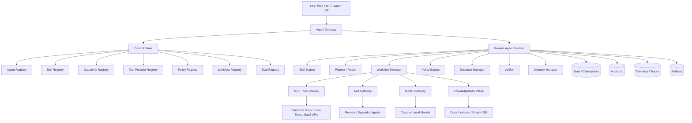

---

# 7. Control Plane vs Execution Plane

## 7.1 Vì sao cần tách

Nếu để workflow runtime quản lý luôn skill registry, policy, tool mapping và eval, platform sẽ khó mở rộng. Cần tách:

```text
Control Plane = định nghĩa, quản trị, versioning, validation, publishing
Execution Plane = thực thi task, gọi model/tool, checkpoint, trace, approval
```

## 7.2 Control Plane

Chịu trách nhiệm:

- Agent templates.
- Agent manifests.
- Skill packages.
- Capability contracts.
- Tool providers.
- Policy profiles.
- Workflow definitions.
- Eval datasets.
- Release gates.
- Ownership và lifecycle.

## 7.3 Execution Plane

Chịu trách nhiệm:

- Load agent profile.
- Select skill.
- Compose runtime context.
- Execute graph.
- Call model.
- Propose tool call.
- Policy-check action.
- Ask approval.
- Execute tool.
- Create evidence.
- Verify output.
- Persist state/audit/trace.

## 7.4 Boundary contract

Runtime không đọc file skill tùy tiện từ filesystem production. Runtime nhận resolved package từ control plane:

```json
{
  "agent_profile": {},
  "resolved_skills": [],
  "resolved_workflow": {},
  "effective_policy": {},
  "tool_bindings": {},
  "model_policy": {},
  "eval_profile": {}
}
```

---

# 8. Domain Model

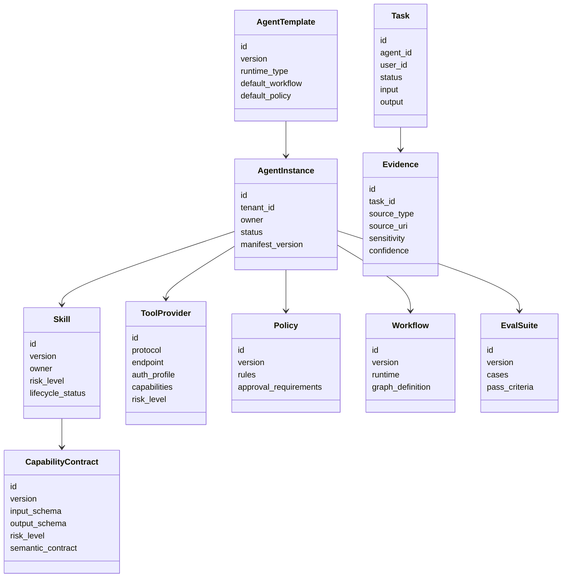

---

# 9. Agent Composition Model

## 9.1 Agent manifest

```yaml
apiVersion: agents.platform/v1
kind: Agent
metadata:
  id: sre-monitoring-agent
  name: SRE Monitoring Agent
  owner: sre-platform-team
spec:
  template: generic-task-agent@1.0.0
  purpose: Investigate production alerts and recommend safe remediation.
  skills:
    - incident-triage@1.0.0
    - metrics-analysis@1.1.0
    - log-analysis@1.2.0
  capabilityBindings:
    metrics.query@1.0: prometheus-mcp.query
    logs.search@1.0: elasticsearch-mcp.search
    traces.search@1.0: jaeger-mcp.find_traces
  knowledgeScopes:
    - service_runbooks
    - past_incidents
  memoryScopes:
    - session
    - agent
  policy: production-read-mostly@2.0.0
  workflow: incident_triage_graph@1.0.0
  modelPolicy: sre-agent-model-policy@1.0.0
  evalProfile: sre-monitoring-agent-evals@1.0.0
```

## 9.2 Binding validation

Trước khi publish agent, platform phải validate:

1. Skills tồn tại và không deprecated.
2. Skill risk level phù hợp agent risk profile.
3. Required capability contracts được bind provider.
4. Tool provider implement đúng contract version.
5. Policy cho phép required capabilities.
6. Workflow runtime tương thích.
7. Knowledge scopes hợp lệ theo tenant/user/team ACL.
8. Model policy phù hợp data sensitivity.
9. Eval suite pass.
10. Owner approval hoàn tất.

## 9.3 Effective policy composition

Effective policy được compose từ nhiều nguồn:

```text
platform base policy
+ tenant policy
+ environment policy
+ agent policy
+ skill policy hints
+ tool provider policy
+ user/session constraints
= effective runtime policy
```

---

# 10. Skill System

## 10.1 Skill package structure

```text
skills/
  incident-triage/
    SKILL.md
    skill.yaml
    workflow.fragment.yaml
    policy.hints.yaml
    capability_requirements.yaml
    output_schema.json
    examples/
      example_1.md
      example_2.md
    evals/
      golden_cases.yaml
      safety_cases.yaml
      tool_trajectory_cases.yaml
    templates/
      incident_report.md
      slack_update.md
      postmortem.md
    resources/
      triage_checklist.md
      severity_matrix.md
      runbook_style_guide.md
```

## 10.2 `SKILL.md` example

```markdown
# Incident Triage Skill

## When to use
Use this skill when the user asks to investigate alerts, production errors,
latency spikes, availability drops, incident timelines, or suspected regressions.

## Workflow
1. Clarify scope.
2. Identify affected services.
3. Collect metrics, logs, traces and deployment events.
4. Correlate timeline.
5. Generate hypotheses.
6. Verify each hypothesis with evidence.
7. Recommend remediation.
8. Draft incident update or postmortem if requested.

## Output requirements
- Always include evidence.
- Separate facts from hypotheses.
- Never claim root cause without supporting data.
- Mark confidence level.
- Include next recommended actions.

## Safety constraints
- Do not execute remediation without approval.
- Do not expose secrets found in logs.
- Do not send external messages directly unless explicitly approved.
```

## 10.3 `skill.yaml`

```yaml
id: incident-triage
version: 1.0.0
name: Incident Triage
description: Diagnose production incidents using metrics, logs, traces, deployments and runbooks.
owner: sre-platform-team
risk_level: medium
lifecycle_status: approved

triggers:
  intents:
    - investigate_incident
    - analyze_alert
    - diagnose_outage
  keywords:
    - incident
    - alert
    - outage
    - latency spike
    - error rate
    - SLO burn

requires:
  capabilities:
    - metrics.query@1.0
    - logs.search@1.0
    - traces.search@1.0
    - deployments.read@1.0
    - runbooks.read@1.0

optional_capabilities:
  - incident.read@1.0
  - message.draft@1.0
  - postmortem.write@1.0

default_workflow: incident_triage_graph@1.0.0
output_schema: incident_analysis_report@1.0.0
```

## 10.4 Skill lifecycle

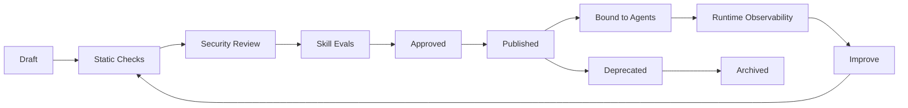

## 10.5 Skill selection

Skill selection dùng nhiều tín hiệu:

- Intent classification.
- Keywords.
- Agent default skills.
- Task metadata.
- Required output type.
- Available capabilities.
- Policy constraints.
- Past success rate.
- Manual override.

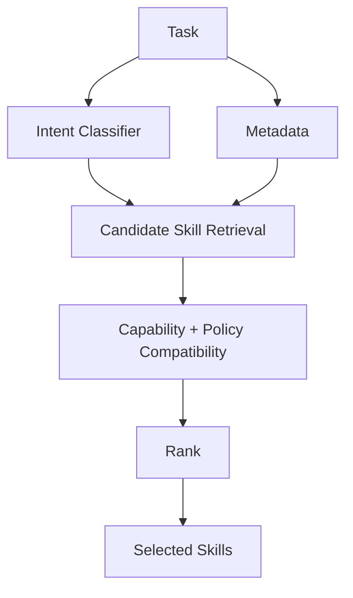

---

# 11. Capability Contract System

## 11.1 Vì sao capability contract quan trọng

Capability abstraction chỉ hữu ích nếu có contract rõ. Nếu chỉ đổi tên `prometheus.query` thành `metrics.query`, platform vẫn không validate được behavior.

Capability contract cần định nghĩa:

- ID và version.
- Input schema.
- Output schema.
- Access type.
- Risk level.
- Semantic guarantees.
- Constraints.
- Evidence behavior.
- Compatibility rules.

## 11.2 Capability contract example

```yaml
apiVersion: agents.platform/v1
kind: CapabilityContract
metadata:
  id: metrics.query
  version: 1.0.0
spec:
  category: observability
  accessType: read
  riskLevel: low
  inputSchema:
    type: object
    required:
      - query
      - time_range
    properties:
      query:
        type: string
      time_range:
        type: object
        required: [start, end]
      step:
        type: string
  outputSchema:
    type: object
    required:
      - series
      - evidence_id
      - metadata
  semanticContract:
    guarantees:
      - Returns time-series metric data.
      - Does not mutate external systems.
      - Does not expose raw credentials.
    constraints:
      max_time_range: 30d
      max_series: 1000
      requires_tenant_scope: true
  evidence:
    creates_evidence: true
    evidence_type: metric_observation
```

## 11.3 Capability categories

| Category | Example capabilities |
|---|---|
| Knowledge | `knowledge.search`, `document.read`, `citation.extract` |
| Workspace | `file.read`, `file.patch`, `shell.run`, `git.diff` |
| Observability | `metrics.query`, `logs.search`, `traces.search` |
| Ticketing | `ticket.read`, `ticket.create`, `ticket.update` |
| Messaging | `message.draft`, `message.send` |
| CRM | `customer.read`, `case.update` |
| Payment | `payment.read`, `refund.execute` |
| Deployment | `deployments.read`, `deployment.rollback`, `service.restart` |
| Security | `dependency.scan`, `cve.search`, `secret.scan` |

## 11.4 Risk classification

| Risk | Examples | Default behavior |
|---|---|---|
| Low | Read docs, query public/internal metrics | Allow if authorized |
| Medium | Read logs, read customer records | Allow with audit/redaction |
| High | Send message, create ticket, update CRM | Require approval by default |
| Critical | Rollback deploy, delete data, refund, financial transaction | Strong approval or deny |

---

# 12. Tool Plane và MCP Gateway

## 12.1 Vai trò của MCP

MCP là integration boundary cho tools, data sources, documents, APIs, local resources và enterprise systems.

Platform không nên để runtime gọi trực tiếp SDK của Jira, Prometheus, GitHub hoặc database. Runtime gọi capability, gateway resolve provider, policy kiểm tra, MCP server thực hiện.

```text
Agent Runtime
-> Capability
-> Policy Check
-> MCP Gateway
-> MCP Server
-> External System
```

## 12.2 MCP Gateway architecture

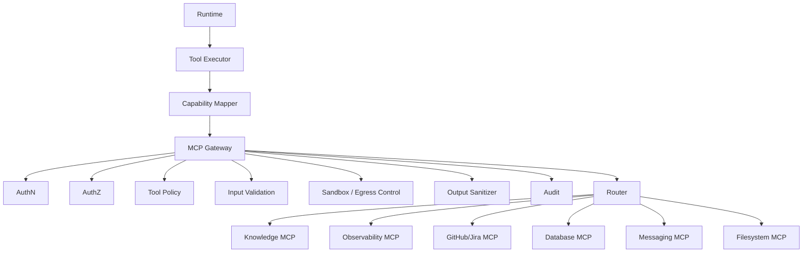

## 12.3 Tool provider manifest

```yaml
apiVersion: agents.platform/v1
kind: ToolProvider
metadata:
  id: prometheus-mcp
  name: Prometheus MCP Server
spec:
  protocol: mcp
  transport: http
  endpoint: https://mcp.company.com/prometheus
  authProfile: service-oauth
  capabilities:
    - contract: metrics.query@1.0
      tool: query
      riskLevel: low
  tenantScope: required
  outputSanitization:
    redactSecrets: true
    maxPayloadBytes: 1000000
```

## 12.4 Tool execution contract

```json
{
  "task_id": "task_123",
  "trace_id": "trace_abc",
  "agent_id": "monitoring-agent",
  "user_id": "user_456",
  "tenant_id": "tenant_a",
  "capability": "metrics.query@1.0",
  "provider": "prometheus-mcp",
  "tool": "query",
  "input": {
    "query": "rate(http_requests_total{status=~\"5..\"}[5m])",
    "time_range": {
      "start": "2026-06-17T09:30:00Z",
      "end": "2026-06-17T10:00:00Z"
    }
  },
  "policy_context": {
    "risk_level": "low",
    "approval_id": null
  }
}
```

## 12.5 Output sanitization

MCP Gateway phải sanitize output:

- Redact secrets.
- Redact PII nếu policy yêu cầu.
- Limit payload size.
- Tag untrusted content.
- Preserve source metadata.
- Attach evidence IDs.
- Strip executable/untrusted instructions khỏi context nếu cần.

---

# 13. Workflow Runtime với LangGraph

## 13.1 Runtime responsibilities

Generic Agent Runtime chịu trách nhiệm:

- Load agent profile.
- Load selected skills.
- Compose runtime instructions.
- Select workflow.
- Maintain state.
- Plan next actions.
- Propose tool calls.
- Policy-check tool calls.
- Delegate qua A2A nếu cần.
- Request human approval.
- Create evidence.
- Verify output.
- Persist audit và trace.

## 13.2 Generic runtime state

```python
from typing import Any, TypedDict

class AgentState(TypedDict):
    task_id: str
    tenant_id: str
    user_id: str
    agent_id: str
    session_id: str
    trace_id: str

    input: str
    task_metadata: dict[str, Any]

    agent_profile: dict[str, Any]
    selected_skills: list[dict[str, Any]]
    effective_policy: dict[str, Any]
    workflow_id: str
    model_policy: dict[str, Any]

    messages: list[dict[str, Any]]
    plan: list[dict[str, Any]]
    observations: list[dict[str, Any]]
    evidence: list[dict[str, Any]]

    proposed_actions: list[dict[str, Any]]
    tool_calls: list[dict[str, Any]]
    approvals: list[dict[str, Any]]
    delegated_tasks: list[dict[str, Any]]

    intermediate_artifacts: dict[str, Any]
    final_answer: str | None
    final_artifacts: list[dict[str, Any]]

    risk_level: str
    verification_results: dict[str, Any]
    eval_results: dict[str, Any]
```

## 13.3 Generic workflow

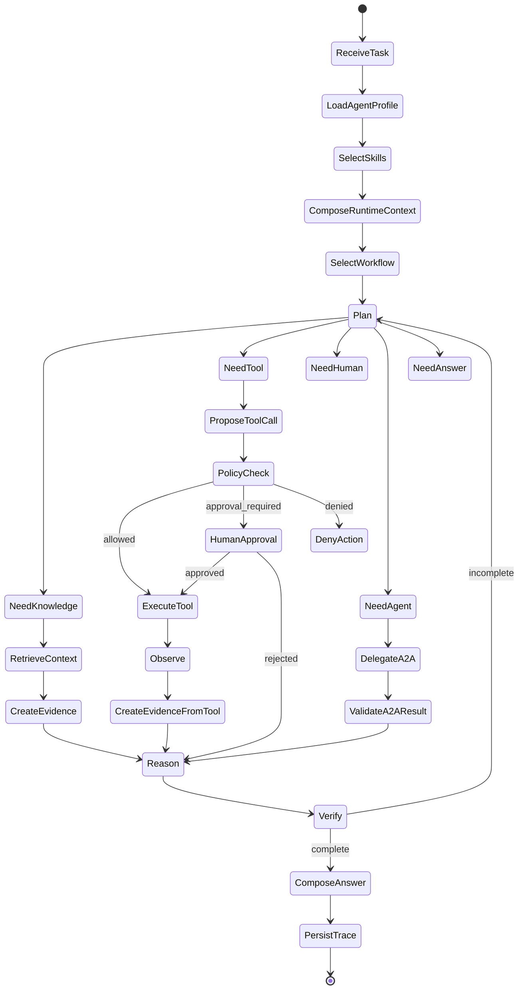

## 13.4 Workflow types

| Workflow | Use case |
|---|---|
| `general_reasoning_graph` | Q&A, analysis, simple tasks |
| `research_graph` | Search, cite, compare, synthesize |
| `coding_task_graph` | Read code, patch, test, summarize |
| `incident_triage_graph` | Metrics/logs/traces/runbooks |
| `support_case_graph` | Ticket analysis, policy lookup, draft response |
| `security_review_graph` | Asset discovery, scan review, risk scoring |
| `data_analysis_graph` | Query data, analyze, chart, report |

## 13.5 Workflow definition example

```yaml
id: incident_triage_graph
version: 1.0.0
runtime: langgraph
state_schema: AgentState
nodes:
  - id: scope_incident
    type: llm_reasoning
  - id: collect_deployments
    type: capability_call
    capability: deployments.read@1.0
  - id: collect_metrics
    type: capability_call
    capability: metrics.query@1.0
  - id: collect_logs
    type: capability_call
    capability: logs.search@1.0
  - id: collect_traces
    type: capability_call
    capability: traces.search@1.0
  - id: correlate_timeline
    type: llm_reasoning
  - id: generate_hypotheses
    type: llm_reasoning
  - id: verify_hypotheses
    type: evaluator
  - id: recommend_remediation
    type: llm_reasoning
  - id: approval_if_needed
    type: human_approval
  - id: compose_report
    type: output_composer
```

---

# 14. Policy, Permission và Approval

## 14.1 Policy engine responsibilities

Policy engine quyết định:

- Action có được phép không?
- Có cần approval không?
- Ai được approve?
- Có cần multi-party approval không?
- Có cần redaction không?
- Có cần audit đặc biệt không?
- Có cần block theo environment không?

## 14.2 Policy decision model

```text
ALLOW
REQUIRE_APPROVAL
DENY
REQUIRE_TRANSFORM
REQUIRE_STEP_UP_AUTH
```

## 14.3 Policy check flow

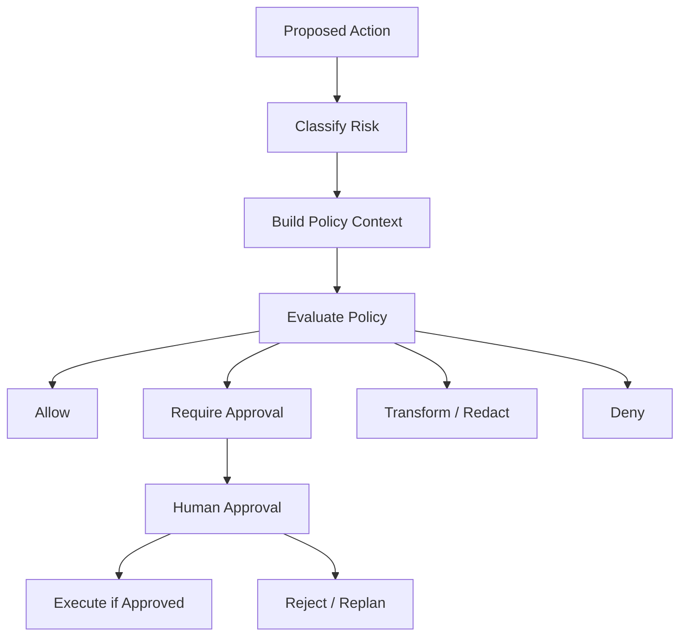

## 14.4 Policy manifest

```yaml
apiVersion: agents.platform/v1
kind: Policy
metadata:
  id: production-read-mostly
  version: 2.0.0
spec:
  rules:
    - match:
        capability: metrics.query@1.0
      decision: allow

    - match:
        capability: logs.search@1.0
      decision: allow
      transforms:
        - redact_secrets
        - redact_pii_if_external

    - match:
        capability: message.send@1.0
      decision: require_approval
      approvers:
        - role:sre_oncall

    - match:
        capability: deployment.rollback@1.0
        environment: prod
      decision: require_approval
      approvers:
        - role:sre_lead
        - role:service_owner

    - match:
        capability: secrets.read@1.0
      decision: deny
```

## 14.5 Approval object

```json
{
  "approval_id": "appr_123",
  "task_id": "task_456",
  "agent_id": "monitoring-agent",
  "action": "deployment.rollback@1.0",
  "risk_level": "critical",
  "reason": "Agent recommends rollback due to 5xx spike after deploy v1.2.3",
  "evidence_refs": ["ev_1", "ev_2", "ev_3"],
  "requested_by": "agent",
  "approvers": ["sre_lead", "service_owner"],
  "status": "pending"
}
```

---

# 15. Evidence, Grounding và Verification

## 15.1 Vì sao evidence là first-class

Agentic systems dễ tạo ra câu trả lời nghe hợp lý nhưng không có căn cứ. Với enterprise use cases như incident response, support, security hoặc finance, mọi kết luận quan trọng phải có evidence.

## 15.2 Evidence object

```json
{
  "evidence_id": "ev_123",
  "task_id": "task_456",
  "source_type": "tool_result",
  "source_uri": "prometheus://query/rate-http-5xx",
  "capability": "metrics.query@1.0",
  "timestamp": "2026-06-17T10:00:00Z",
  "sensitivity": "internal",
  "confidence": 0.87,
  "summary": "5xx rate increased from 0.2% to 8.4% after deployment v1.2.3.",
  "raw_ref": "object://task_456/tool_result_789",
  "trusted": true
}
```

## 15.3 Claim-to-evidence mapping

Final output nên có mapping:

```json
{
  "claim": "Error rate increased after deployment v1.2.3.",
  "claim_type": "verified_observation",
  "evidence_refs": ["ev_metrics_1", "ev_deploy_1"],
  "confidence": "high"
}
```

## 15.4 Verification rules

Verifier cần kiểm tra:

1. Output có đúng schema không?
2. Root cause claim có evidence không?
3. Recommendation có policy/risk annotation không?
4. Sensitive data có bị leak không?
5. Tool observations có bị diễn giải quá mức không?
6. Confidence có phù hợp evidence không?
7. Có phân biệt fact/hypothesis không?

---

# 16. Knowledge Plane và RAG

## 16.1 RAG và MCP không cạnh tranh

```text
RAG = retrieval engine
MCP = protocol/interface để agent gọi retrieval engine
```

Agent nên gọi knowledge qua capability:

```text
knowledge.search@1.0
runbook.read@1.0
document.read@1.0
citation.extract@1.0
```

## 16.2 Knowledge architecture

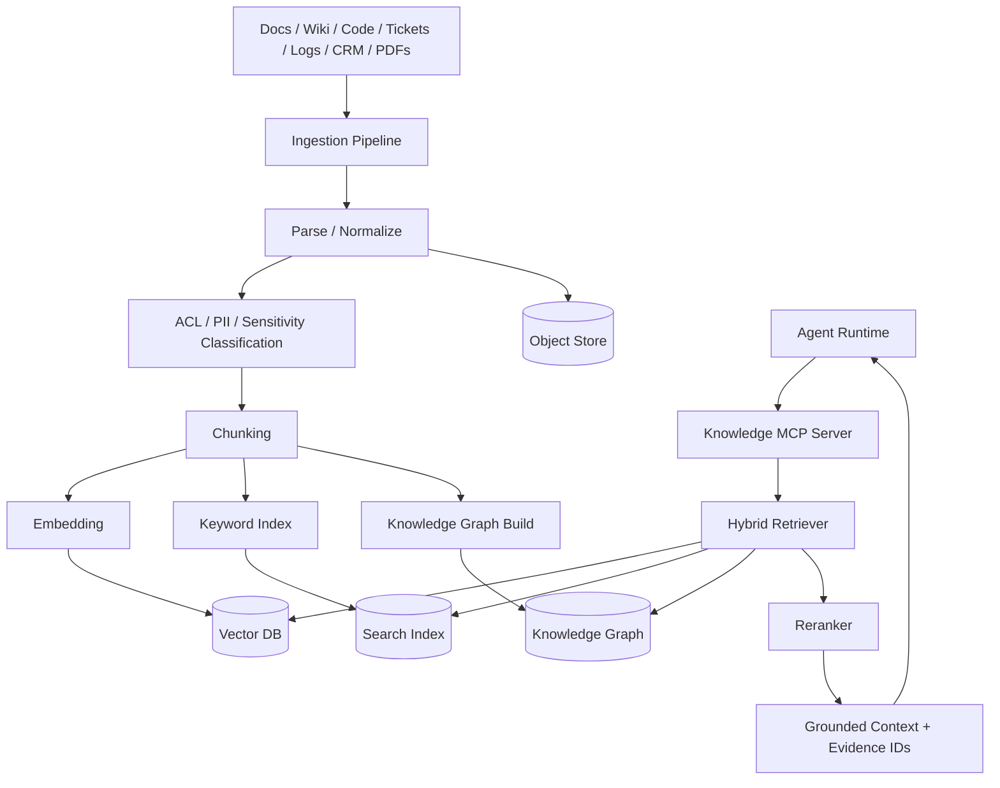

## 16.3 Knowledge scopes

```yaml
knowledgeScopes:
  service_runbooks:
    acl: team:sre
    sensitivity: internal
  customer_contracts:
    acl: team:support
    sensitivity: confidential
  source_code:
    acl: repo-permission-inherited
    sensitivity: confidential
```

## 16.4 Retrieval requirements

RAG service nên hỗ trợ:

- Hybrid retrieval.
- Metadata filtering.
- ACL-aware retrieval.
- Freshness scoring.
- Deduplication.
- Reranking.
- Source citation.
- Evidence IDs.
- Document versioning.
- PII redaction.
- Query rewriting.
- Multi-hop retrieval.
- Feedback loop.

---

# 17. Memory Architecture

## 17.1 Memory types

| Type | Scope | Example |
|---|---|---|
| Session memory | Single task/session | Current observations |
| Task memory | Task workspace | Artifacts, evidence, decisions |
| Agent memory | Agent instance | Past successful workflows |
| User memory | User-specific | Preferences, frequent projects |
| Team memory | Team/org | Runbooks, conventions |
| Domain memory | Domain-specific | Known incidents, coding standards |
| Episodic memory | Past task traces | What happened in task X |

## 17.2 Memory policy

```yaml
memoryPolicy:
  session:
    retention: 30d
  task:
    retention: 180d
  agent:
    retention: 180d
    requiresUserConsent: false
  user:
    retention: 365d
    requiresUserConsent: true
  sensitiveData:
    store: false
```

## 17.3 Memory safety

Cần tránh:

- Lưu secrets.
- Lưu PII không cần thiết.
- Cross-tenant leakage.
- Poisoned memory.
- Unverified facts thành long-term memory.
- Lưu tool output raw quá lâu.

---

# 18. Model Gateway

## 18.1 Vì sao cần Model Gateway

Không nên để từng agent gọi trực tiếp model provider. Model Gateway giúp:

- Routing theo task/risk.
- Cost control.
- Latency optimization.
- Fallback.
- Prompt logging theo policy.
- PII/secret redaction.
- Model allowlist.
- Token accounting.
- Caching.
- Evaluation hooks.

## 18.2 Architecture

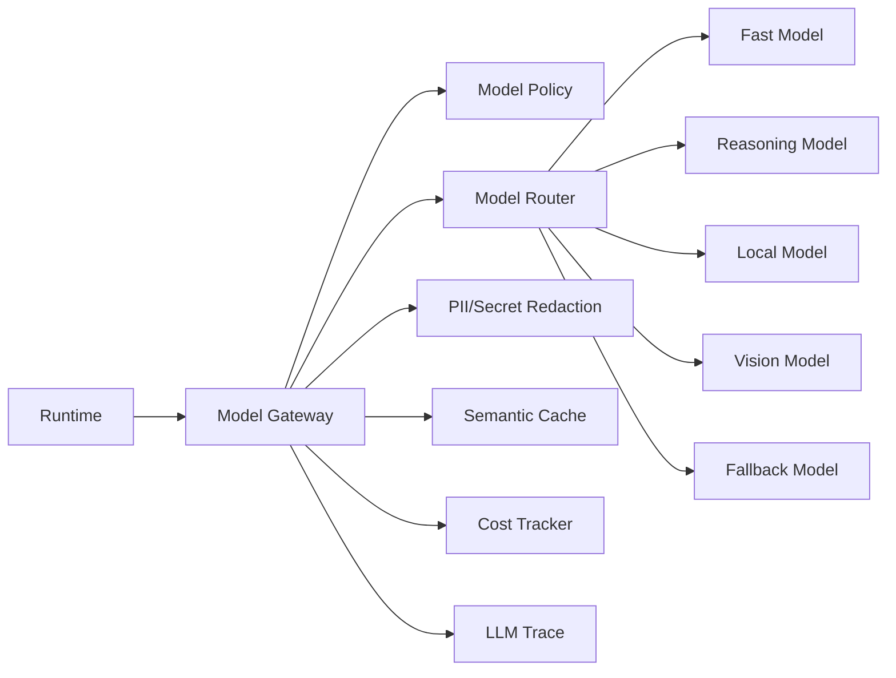

## 18.3 Model policy

```yaml
modelPolicy:
  default:
    model: fast-reasoning-model
    maxTokens: 8000
    temperature: 0.2
  highRiskReasoning:
    model: deep-reasoning-model
    requireTrace: true
  piiSensitive:
    model: enterprise-approved-model
    redaction: required
  localOnly:
    model: local-llm
    network: false
```

---

# 19. A2A Collaboration Plane

## 19.1 Khi nào dùng A2A

Dùng A2A khi:

- Cần gọi agent khác có lifecycle riêng.
- Agent khác thuộc team khác.
- Agent khác chạy framework khác.
- Agent khác có capability chuyên sâu.
- Cần async task delegation.
- Cần interoperability với vendor/partner agent.

Không dùng A2A để gọi function/tool đơn giản. Dùng MCP cho tool.

## 19.2 A2A architecture

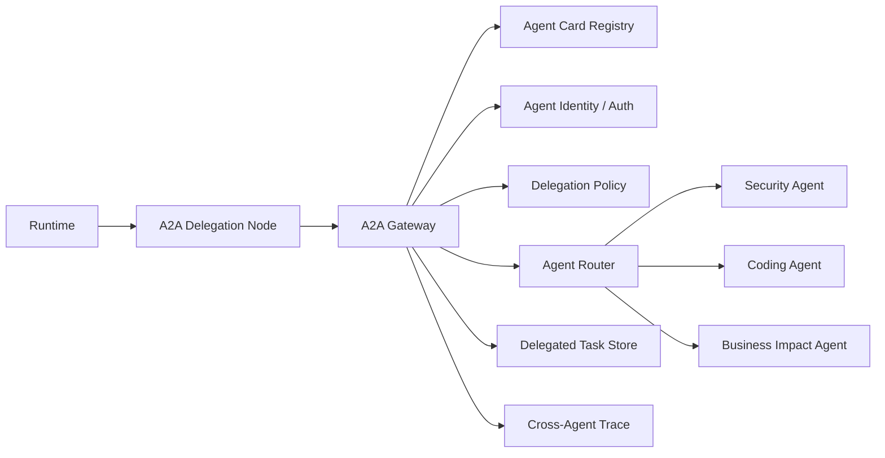

## 19.3 Agent Card

```json
{
  "name": "security-review-agent",
  "version": "1.2.0",
  "description": "Reviews code, configs and runtime evidence for security risks.",
  "capabilities": [
    "code_security_review",
    "dependency_risk_analysis",
    "configuration_review"
  ],
  "input_modes": ["text", "markdown", "json"],
  "output_modes": ["markdown", "json"],
  "auth": "oauth2",
  "sla": {
    "timeout_seconds": 300
  }
}
```

## 19.4 A2A result validation

Không tin blindly vào remote agent. Kết quả A2A cần:

- Schema validation.
- Source/evidence validation.
- Confidence score.
- Policy check.
- Trace linkage.
- Optional verifier node.

## 19.5 MVP position

A2A không thuộc MVP. Chỉ thêm sau khi:

1. Single-agent runtime ổn định.
2. MCP tool plane ổn định.
3. Policy-before-action hoạt động.
4. Eval/release gate hoạt động.
5. Trace/audit đủ tốt.

---

# 20. Security Architecture

## 20.1 Threat model

Nền tảng cần phòng:

1. Prompt injection từ docs/web/email/logs.
2. Tool misuse.
3. Unauthorized data access.
4. Cross-tenant leakage.
5. Secret exfiltration.
6. Unsafe code/shell execution.
7. Malicious skill package.
8. Malicious MCP server.
9. Malicious remote agent qua A2A.
10. Over-permissioned agent identity.
11. Audit evasion.
12. Data retention violation.
13. Model/provider misconfiguration.
14. Insecure output handling.
15. Excessive agency.

## 20.2 Security layers

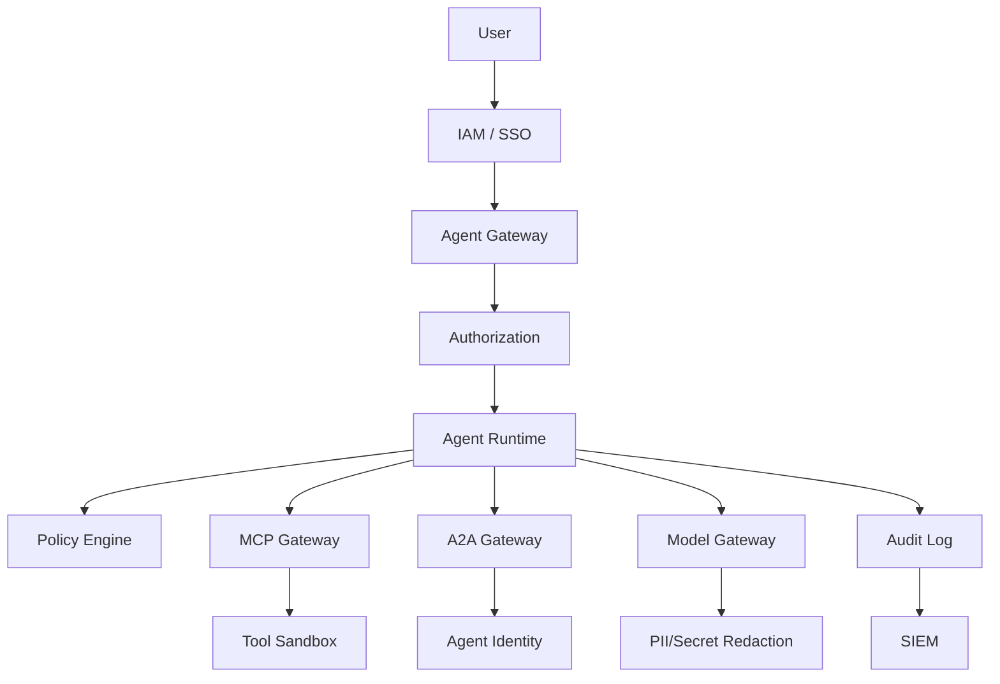

## 20.3 Identity model

Phân biệt:

- User identity.
- Agent identity.
- Service identity.
- Tool provider identity.
- Remote agent identity.

Tool call phải biết:

```text
user -> agent -> capability -> provider -> external system
```

## 20.4 Authorization model

Nên kết hợp:

- RBAC.
- ABAC.
- ReBAC nếu cần.
- Tenant isolation.
- Capability-level authorization.
- Environment-level policy.
- Task-scoped credentials.

## 20.5 Prompt injection controls

Controls bắt buộc:

- Tag untrusted content.
- Tách system/developer instruction khỏi retrieved content.
- Không cho retrieved content override policy.
- Tool-call firewall.
- Output validation.
- Evidence verification.
- Human approval cho side effects.
- Deny dangerous capabilities trong untrusted context.

## 20.6 Skill supply-chain security

Skill là operational text nên có thể bị lạm dụng. Cần:

- Signed skill packages.
- Owner metadata.
- Version pinning.
- Review workflow.
- Static checks.
- Semantic checks.
- Eval checks.
- Allowed source registry.
- Dependency scanning.
- Runtime permission restrictions.

## 20.7 MCP security

MCP server cần:

- Authentication.
- Authorization.
- Transport security.
- Tool allowlist.
- Input validation.
- Output sanitization.
- Rate limiting.
- Audit.
- Network egress control.
- Sandbox cho local/stdio tools.

## 20.8 Secret handling

Agent không nên thấy raw secrets.

```text
Agent requests capability
-> provider uses secret internally
-> provider returns sanitized result
```

---

# 21. Observability, Audit và Telemetry

## 21.1 Trace requirements

Mỗi task cần trace:

- Task metadata.
- Agent version.
- Skill versions.
- Workflow version.
- Model calls.
- Tool calls.
- A2A calls.
- Approvals.
- Evidence.
- Final output.
- Evaluation scores.
- Cost/latency.

## 21.2 Event model

Runtime nên emit events:

```text
task.started
agent.profile.loaded
skill.selected
workflow.node.started
model.called
tool.proposed
policy.evaluated
approval.requested
approval.granted
approval.denied
tool.executed
evidence.created
verifier.completed
task.completed
eval.scored
```

## 21.3 Trace structure

```json
{
  "trace_id": "trace_123",
  "task_id": "task_456",
  "agent_id": "monitoring-agent",
  "agent_version": "1.0.0",
  "skills": ["incident-triage@1.0.0", "log-analysis@1.2.0"],
  "workflow": "incident_triage_graph@1.0.0",
  "nodes": [
    {
      "node": "collect_metrics",
      "duration_ms": 430,
      "tool_calls": ["tool_1"]
    }
  ],
  "cost": {
    "input_tokens": 12000,
    "output_tokens": 3000,
    "usd": 0.42
  }
}
```

## 21.4 Metrics

| Metric | Meaning |
|---|---|
| task_success_rate | % tasks completed |
| tool_failure_rate | % failed tool calls |
| approval_rate | % actions requiring approval |
| approval_rejection_rate | % rejected risky actions |
| average_latency | E2E latency |
| cost_per_task | Token/model cost |
| eval_pass_rate | Offline/online eval pass |
| hallucination_rate | Estimated groundedness failures |
| fallback_rate | Model/tool/agent fallback frequency |

## 21.5 Audit vs trace

Trace dùng để debug/optimize. Audit dùng cho compliance/security/legal.

Audit log phải append-only hoặc immutable. Audit events:

```text
agent.created
agent.updated
skill.bound
task.started
tool.called
approval.requested
approval.granted
approval.denied
a2a.delegated
output.generated
policy.denied
```

---

# 22. Evaluation Architecture

## 22.1 Vì sao eval là first-class

Agentic systems không ổn định nếu không có eval. Mỗi skill và agent cần eval trước khi publish.

## 22.2 Eval layers

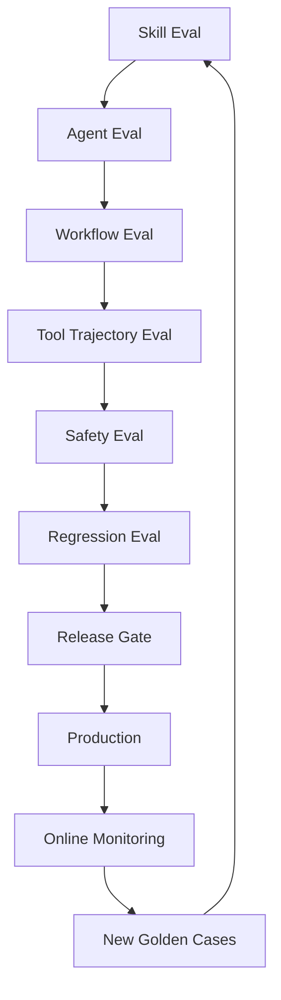

## 22.3 Eval types

| Eval | Mục tiêu |
|---|---|
| Skill activation eval | Chọn đúng skill không? |
| Workflow eval | Đi đúng graph không? |
| Tool trajectory eval | Gọi đúng tool theo thứ tự hợp lý không? |
| Retrieval eval | Context đúng/đủ/có citation không? |
| Final answer eval | Output đúng schema, rõ ràng, grounded không? |
| Safety eval | Có leak data, injection, unsafe action không? |
| Policy eval | Có xin approval khi cần không? |
| Cost/latency eval | Có vượt SLO/budget không? |
| Regression eval | Version mới có làm hỏng behavior cũ không? |

## 22.4 Eval case schema

```yaml
id: incident_latency_spike_001
task:
  input: "Investigate checkout latency spike after latest deploy"
  metadata:
    service: checkout
    env: prod
expected:
  selected_skills:
    must_include:
      - incident-triage@1.0.0
  tool_trajectory:
    must_call:
      - deployments.read@1.0
      - metrics.query@1.0
      - logs.search@1.0
    must_not_call:
      - deployment.rollback@1.0
  policy:
    must_require_approval_for:
      - deployment.rollback@1.0
  output:
    required_sections:
      - timeline
      - evidence
      - hypotheses
      - confidence
      - next_actions
  grounding:
    all_root_cause_claims_require_evidence: true
```

## 22.5 Release gate

Agent chỉ được publish nếu:

- Required skill evals pass.
- Policy eval pass.
- Safety eval pass.
- Tool compatibility pass.
- Cost/latency within acceptable range.
- Owner approval complete.

---

# 23. Universal CLI

## 23.1 CLI không coding-centric

Không thiết kế CLI chỉ xoay quanh code. Nên là Universal Agent CLI:

```bash
agent create
agent bind
agent run
agent inspect
agent approve
agent skills
agent tools
agent eval
agent publish
agent sessions
```

## 23.2 Command examples

Create monitoring agent:

```bash
agent create monitoring-agent \
  --template generic-task-agent@1.0.0 \
  --skill incident-triage@1.0.0 \
  --skill metrics-analysis@1.1.0 \
  --skill log-analysis@1.2.0 \
  --tool-group observability-readonly \
  --policy production-read-mostly@2.0.0
```

Run monitoring task:

```bash
agent run monitoring-agent \
  "Investigate checkout latency spike from the last 30 minutes"
```

Create research agent:

```bash
agent create research-agent \
  --skill web-research@1.0.0 \
  --skill source-evaluation@1.0.0 \
  --skill citation-analysis@1.0.0 \
  --tool browser \
  --tool docs \
  --policy read-only@1.0.0
```

## 23.3 Local storage

```text
.agent/
  config.yaml
  agents/
    monitoring-agent.yaml
    coding-agent.yaml
  skills/
    incident-triage/
    bugfix/
  capabilities/
    metrics.query.yaml
    logs.search.yaml
  sessions/
    task_123/
      events.jsonl
      state.sqlite
      trace.jsonl
      artifacts/
  policies/
  tools/
```

---

# 24. Server/API Design

## 24.1 REST endpoints

```text
POST   /agents
GET    /agents
GET    /agents/{agent_id}
PATCH  /agents/{agent_id}
POST   /agents/{agent_id}/run

GET    /skills
POST   /skills
GET    /skills/{skill_id}
POST   /skills/{skill_id}/validate
POST   /skills/{skill_id}/publish

GET    /capabilities
GET    /capabilities/{capability_id}
GET    /tools/providers
POST   /tools/bindings

GET    /policies
POST   /approvals/{approval_id}/approve
POST   /approvals/{approval_id}/deny

GET    /tasks/{task_id}
GET    /tasks/{task_id}/trace
GET    /tasks/{task_id}/artifacts
GET    /tasks/{task_id}/evidence
```

## 24.2 Run task API

```json
POST /agents/sre-monitoring-agent/run
{
  "input": "Investigate high error rate in checkout service",
  "metadata": {
    "environment": "prod",
    "service": "checkout",
    "time_window": "last_30_minutes"
  }
}
```

## 24.3 Final response object

```json
{
  "task_id": "task_123",
  "status": "completed",
  "summary": "Error rate increased after deployment v1.2.3.",
  "confidence": "medium",
  "evidence": ["ev_metrics_1", "ev_logs_2", "ev_deploy_3"],
  "recommended_actions": [
    {
      "action": "rollback_deployment@1.0",
      "requires_approval": true,
      "risk": "critical"
    }
  ],
  "artifacts": [
    {
      "type": "incident_report",
      "uri": "artifact://task_123/report.md"
    }
  ]
}
```

---

# 25. Storage và Data Model

## 25.1 Stores

| Store | Purpose | Suggested technology |
|---|---|---|
| Agent Registry DB | Agents/templates/bindings | Postgres |
| Skill Registry | Skill packages/metadata | Git + object store + Postgres |
| Capability Registry | Capability contracts | Postgres/Git |
| State Store | Runtime state | Postgres/Redis |
| Checkpoint Store | Durable checkpoints | Postgres |
| Audit Store | Immutable audit events | Postgres/EventStore/Kafka + object store |
| Trace Store | Observability traces | OpenTelemetry backend/LangSmith/Langfuse |
| Vector Store | Embeddings | pgvector/Qdrant/Weaviate/Milvus |
| Search Index | Keyword/hybrid search | OpenSearch/Elasticsearch |
| Object Store | Artifacts/docs/raw tool outputs | S3-compatible |
| Eval Store | Eval results/datasets | Postgres + object store |

## 25.2 Core tables

```sql
create table agents (
  id text primary key,
  tenant_id text not null,
  name text not null,
  template_id text not null,
  purpose text,
  status text not null,
  manifest jsonb not null,
  created_at timestamp not null,
  updated_at timestamp not null
);

create table skills (
  id text not null,
  version text not null,
  owner text not null,
  risk_level text not null,
  lifecycle_status text not null,
  package_uri text not null,
  metadata jsonb not null,
  primary key (id, version)
);

create table capability_contracts (
  id text not null,
  version text not null,
  risk_level text not null,
  input_schema jsonb not null,
  output_schema jsonb not null,
  semantic_contract jsonb not null,
  primary key (id, version)
);

create table agent_skill_bindings (
  agent_id text not null,
  skill_id text not null,
  skill_version text not null,
  enabled boolean not null default true,
  priority int not null default 100,
  primary key (agent_id, skill_id, skill_version)
);

create table agent_tool_bindings (
  agent_id text not null,
  capability_id text not null,
  capability_version text not null,
  provider_id text not null,
  tool_name text not null,
  primary key (agent_id, capability_id, capability_version)
);

create table tasks (
  id text primary key,
  tenant_id text not null,
  agent_id text not null,
  user_id text not null,
  status text not null,
  input jsonb not null,
  output jsonb,
  created_at timestamp not null,
  updated_at timestamp not null
);

create table evidence (
  id text primary key,
  task_id text not null,
  source_type text not null,
  source_uri text,
  capability text,
  summary text not null,
  raw_ref text,
  sensitivity text not null,
  confidence numeric,
  created_at timestamp not null
);

create table audit_events (
  id text primary key,
  task_id text,
  agent_id text,
  user_id text,
  event_type text not null,
  payload jsonb not null,
  created_at timestamp not null
);
```

---

# 26. Deployment Architecture

## 26.1 Local-first mode

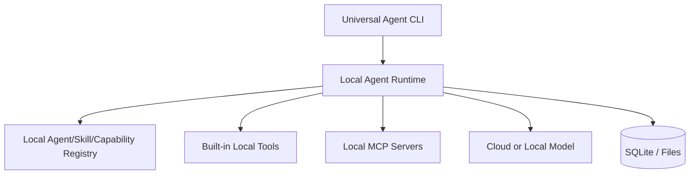

## 26.2 Enterprise mode

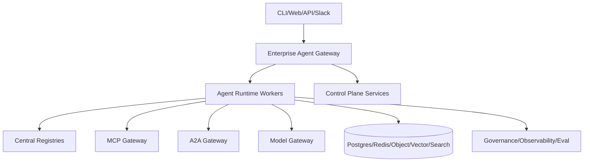

## 26.3 Kubernetes deployment

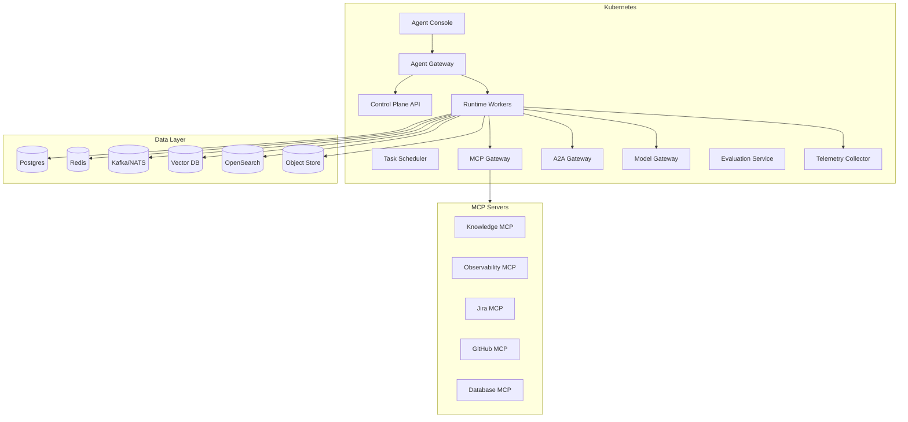

## 26.4 Isolation strategies

| Strategy | Use case |
|---|---|
| Shared runtime, tenant-aware | Low/medium sensitivity |
| Dedicated namespace per tenant | Enterprise customers |
| Dedicated runtime pool per domain | Production/SRE/security |
| Dedicated tool gateway per environment | Prod vs staging |
| Local-only runtime | Sensitive local tasks |

---

# 27. Reference Agent Templates

## 27.1 Research Agent

```yaml
agent:
  id: research-agent
  name: Research Agent
  template: generic-task-agent@1.0.0
  purpose: Research topics, compare sources and produce cited reports.

skills:
  - web-research@1.0.0
  - source-evaluation@1.0.0
  - summarization@1.0.0
  - citation-analysis@1.0.0
  - report-writing@1.0.0

capabilityBindings:
  web.search@1.0: browser.search
  web.fetch@1.0: browser.fetch
  document.read@1.0: document.read
  citation.extract@1.0: citation.extract

policy:
  default_mode: read_only
  denied:
    - external_post@1.0
    - payment.execute@1.0
    - account.change@1.0
```

## 27.2 Coding Agent

```yaml
agent:
  id: coding-agent
  name: Coding Agent
  template: generic-task-agent@1.0.0
  purpose: Modify code safely and verify with tests.

skills:
  - codebase-understanding@1.0.0
  - bug-fixing@1.0.0
  - refactoring@1.0.0
  - test-generation@1.0.0
  - code-review@1.0.0
  - pull-request-drafting@1.0.0

capabilityBindings:
  file.read@1.0: workspace.read_file
  file.patch@1.0: workspace.apply_patch
  code.search@1.0: workspace.search_symbols
  shell.run@1.0: sandbox.run_command
  git.diff@1.0: git.diff
  pr.create@1.0: github.create_pr

policy:
  default_mode: workspace_write
  approval_required:
    - dependency.install@1.0
    - network.access@1.0
    - git.push@1.0
    - pr.create@1.0
    - destructive_command@1.0
```

## 27.3 Monitoring Agent

```yaml
agent:
  id: monitoring-agent
  name: Monitoring Agent
  template: generic-task-agent@1.0.0
  purpose: Investigate production alerts and incidents.

skills:
  - alert-triage@1.0.0
  - metrics-analysis@1.1.0
  - log-analysis@1.2.0
  - trace-analysis@1.0.0
  - deployment-correlation@1.0.0
  - runbook-execution@1.0.0
  - incident-communication@1.0.0
  - postmortem-writing@1.0.0

capabilityBindings:
  metrics.query@1.0: prometheus.query
  logs.search@1.0: elasticsearch.search
  traces.search@1.0: jaeger.search
  deployments.read@1.0: github_deployments.read
  incident.read@1.0: pagerduty.read
  message.draft@1.0: slack.draft

policy:
  default_mode: read_only
  approval_required:
    - service.restart@1.0
    - deployment.rollback@1.0
    - incident.resolve@1.0
    - message.send@1.0
```

## 27.4 Support Agent

```yaml
agent:
  id: refund-support-agent
  name: Refund Support Agent
  template: generic-task-agent@1.0.0
  purpose: Analyze refund requests and draft customer responses.

skills:
  - ticket-analysis@1.0.0
  - refund-policy-analysis@1.0.0
  - customer-tone-writing@1.0.0
  - crm-update@1.0.0
  - email-drafting@1.0.0

capabilityBindings:
  ticket.read@1.0: zendesk.read_ticket
  payment.read@1.0: stripe.read_payment
  policy.search@1.0: kb.search
  email.draft@1.0: gmail.create_draft
  crm.update@1.0: salesforce.update_case

policy:
  default_mode: draft_only
  approval_required:
    - payment.refund@1.0
    - email.send@1.0
    - crm.update@1.0
```

## 27.5 Security Agent

```yaml
agent:
  id: security-review-agent
  name: Security Review Agent
  template: generic-task-agent@1.0.0
  purpose: Review code, configs, dependencies and runtime evidence for security risks.

skills:
  - threat-modeling@1.0.0
  - code-security-review@1.0.0
  - dependency-risk-analysis@1.0.0
  - config-review@1.0.0
  - vulnerability-triage@1.0.0

capabilityBindings:
  repo.read@1.0: github.read_repo
  dependency.scan@1.0: scanner.scan_dependencies
  config.read@1.0: workspace.read_config
  cve.search@1.0: vuln_db.search
  ticket.create@1.0: jira.create_issue

policy:
  default_mode: read_mostly
  approval_required:
    - ticket.create@1.0
    - pr.comment@1.0
    - security_exception.create@1.0
```

---

# 28. Manifest Schemas

## 28.1 Agent manifest schema outline

```yaml
apiVersion: agents.platform/v1
kind: Agent
metadata:
  id: string
  name: string
  owner: string
  labels: object
spec:
  template: string
  purpose: string
  skills:
    - string
  capabilityBindings:
    capability: provider.tool
  knowledgeScopes:
    - string
  memoryScopes:
    - string
  policy: string
  workflow: string
  modelPolicy: string
  evalProfile: string
```

## 28.2 Skill manifest schema outline

```yaml
apiVersion: agents.platform/v1
kind: Skill
metadata:
  id: string
  version: string
  owner: string
spec:
  description: string
  skillFile: SKILL.md
  requiredCapabilities:
    - string
  optionalCapabilities:
    - string
  defaultWorkflow: string
  outputSchema: string
  riskLevel: string
  evals:
    - string
```

## 28.3 Capability manifest schema outline

```yaml
apiVersion: agents.platform/v1
kind: CapabilityContract
metadata:
  id: string
  version: string
spec:
  category: string
  accessType: read | write | execute
  riskLevel: low | medium | high | critical
  inputSchema: object
  outputSchema: object
  semanticContract: object
  evidence: object
```

## 28.4 Policy manifest schema outline

```yaml
apiVersion: agents.platform/v1
kind: Policy
metadata:
  id: string
  version: string
spec:
  rules:
    - match: object
      decision: allow | require_approval | deny | require_transform
      transforms:
        - string
      approvers:
        - string
```

---

# 29. MVP Scope

## 29.1 MVP thesis

MVP phải chứng minh:

> Có thể tạo nhiều agent khác domain bằng cùng runtime, cùng policy engine, cùng capability abstraction, chỉ khác skills/workflow/tool bindings.

## 29.2 MVP includes

```text
Universal CLI
Agent Manifest Loader
Skill Loader
Capability Registry
Tool Binding Resolver
Policy Engine v0
LangGraph Runtime
Local State Store
Audit Event Log
Evidence Object Model
Minimal Eval Runner
2 Reference Agents
```

## 29.3 MVP reference agents

Nên chọn 2 agent:

1. **Research Agent**  
   Read-only, ít rủi ro, chứng minh skill + knowledge + citation.

2. **Coding Agent hoặc Incident Triage Agent**  
   - Nếu target developer: chọn Coding Agent.
   - Nếu target enterprise/SRE: chọn Incident Triage Agent.

## 29.4 MVP excludes

```text
A2A Gateway
Marketplace
Advanced memory
Full enterprise multi-tenancy
Complex UI approval console
Multi-model optimizer
Knowledge graph
Async distributed agents
```

## 29.5 MVP success criteria

MVP đạt nếu:

1. Tạo được agent từ manifest.
2. Load được skill package.
3. Validate capability bindings.
4. Chạy được workflow stateful.
5. Gọi được ít nhất 3 capabilities qua tool executor.
6. Policy block/approval hoạt động với side-effect action.
7. Output có evidence IDs.
8. Audit events được ghi đầy đủ.
9. Eval runner kiểm được skill activation và tool trajectory.
10. Có 2 agents dùng cùng runtime nhưng khác skills/tools/policies.

---

# 30. Implementation Roadmap

## Phase 0: Architecture foundation

Deliverables:

- Domain model.
- Manifest schemas.
- Capability contract schema.
- Policy model.
- Reference workflow definitions.
- Evidence object schema.
- Eval case schema.

## Phase 1: Generic runtime MVP

Deliverables:

- Universal CLI.
- Agent manifest loader.
- Skill loader.
- Generic LangGraph runtime.
- Local state/checkpoint store.
- Basic tool executor.
- Basic policy engine.
- Session logs.
- Evidence manager v0.

Scope:

```text
No A2A
Minimal MCP
No enterprise multi-tenancy
No advanced memory
```

## Phase 2: Skill-centric composition

Deliverables:

- Skill package format.
- Local Skill Registry.
- Skill selector.
- Capability validation.
- 3 reference skills:
  - research
  - incident-triage
  - coding-bugfix

## Phase 3: MCP Gateway

Deliverables:

- MCP client manager.
- Tool capability mapping.
- Tool policy enforcement.
- Tool audit.
- MCP provider registry.
- Example MCP servers:
  - filesystem/workspace
  - knowledge
  - observability
  - GitHub/Jira

## Phase 4: Agent Factory

Deliverables:

- Create agent from manifest/API/CLI.
- Bind skills/tools/policies.
- Validate compatibility.
- Publish agent.
- Inspect agent.

## Phase 5: Evaluation pipeline

Deliverables:

- Skill eval runner.
- Agent eval runner.
- Golden datasets.
- Safety evals.
- Release gates.
- Regression reports.

## Phase 6: A2A Gateway

Deliverables:

- A2A client.
- Agent Card Registry.
- Delegation node.
- Cross-agent trace.
- Result validation.

## Phase 7: Enterprise hardening

Deliverables:

- SSO/IAM.
- Multi-tenancy.
- Central audit.
- DLP.
- SIEM integration.
- Policy admin UI.
- Approval console.
- Team registries.
- Cost management.

---

# 31. Risk Register

| Risk | Impact | Mitigation |
|---|---|---|
| Skill injection / malicious skill | Unsafe behavior | Signed skills, review, eval, sandbox |
| Tool misuse | Data loss / side effects | Policy engine, approval, capability scoping |
| Prompt injection from docs/logs | Wrong actions/data leak | Untrusted tagging, instruction/data separation, tool firewall |
| Over-general runtime | Poor UX/performance | Domain workflow templates and reference agents |
| A2A overuse | Complexity/latency | Use A2A only for independent agents |
| MCP server compromise | Tool/data compromise | Auth, least privilege, network isolation, audit |
| Cross-tenant leakage | Severe compliance issue | Tenant isolation, ACL-aware retrieval, audit |
| Hallucinated evidence | Wrong decisions | Evidence IDs, grounded verification, citations |
| Eval gaps | Regression escapes | Continuous eval and production sampling |
| Cost explosion | Budget issue | Model gateway, quotas, caching, cost tracking |
| Long-running task failure | Poor reliability | Durable execution, checkpoints, retries |
| Human approval fatigue | Users approve blindly | Risk tiering, summaries, batch approvals, policy tuning |
| Secret exfiltration | Security breach | Secret never enters model context, tool-side secret usage |
| Unbounded agency | Unsafe autonomous action | Action budget, risk tiering, approval, deny-by-default critical actions |

---

# 32. Architecture Decision Records

## ADR-001: Agent is composition artifact

**Decision:** Agent được đại diện là composition của template, skills, tools, policies, workflows, model policy và memory scopes.

**Rationale:** Tránh domain-specific agent class explosion và tối đa hóa reuse.

**Consequence:** Cần registries, validators và manifest schemas mạnh.

## ADR-002: Skills are first-class packages

**Decision:** Skill là versioned package chứa `SKILL.md`, metadata, workflow, policy hints, tool requirements, examples và evals.

**Rationale:** Prompt-only skills không đủ cho enterprise governance.

**Consequence:** Cần skill lifecycle, signing, eval và security review.

## ADR-003: Use capability contracts for tools

**Decision:** Skills phụ thuộc vào abstract capability contracts, không phụ thuộc concrete tool providers.

**Rationale:** Cho phép portability giữa Prometheus/Datadog, Elasticsearch/Splunk, Jira/ServiceNow.

**Consequence:** Cần Capability Registry và Capability Mapper.

## ADR-004: Use MCP for tool/context integration

**Decision:** MCP Gateway là standard path cho tools và external context.

**Rationale:** Chuẩn hóa tool discovery, invocation và integration boundaries.

**Consequence:** Cần MCP security, auth, audit và output sanitization.

## ADR-005: Use A2A only for agent delegation

**Decision:** A2A dùng cho independent remote/specialist agents, không dùng cho simple tool calls.

**Rationale:** Tránh multi-agent complexity không cần thiết.

**Consequence:** Cần Agent Card Registry, delegation policy và result validation khi thêm A2A.

## ADR-006: Use LangGraph for stateful workflow orchestration

**Decision:** LangGraph được dùng cho workflow/state orchestration trong runtime đầu tiên.

**Rationale:** Hỗ trợ stateful agent workflows, HITL, durable execution và checkpointing.

**Consequence:** Cần graph templates và state schemas.

## ADR-007: Policy before action

**Decision:** Mọi action đi qua policy trước khi execution.

**Rationale:** Agentic systems có thể tạo side effects; safety yêu cầu runtime enforcement.

**Consequence:** Tool execution có thêm latency và complexity.

## ADR-008: Control plane separated from execution runtime

**Decision:** Registries, validation, publishing và eval thuộc control plane; runtime chỉ nhận resolved artifacts.

**Rationale:** Giảm coupling với runtime framework và hỗ trợ governance.

**Consequence:** Cần artifact resolution layer.

## ADR-009: Evidence is first-class

**Decision:** Evidence object là primitive chính trong runtime và output.

**Rationale:** Grounding, audit, eval và incident/support/security workflows đều cần evidence.

**Consequence:** Tool results và retrieval results phải tạo evidence IDs.

## ADR-010: A2A is not part of MVP

**Decision:** Không build A2A trong MVP.

**Rationale:** Single-agent + MCP + policy + eval phải ổn định trước.

**Consequence:** Multi-agent delegation bị trì hoãn nhưng giảm rủi ro delivery.

---

# 33. Production Readiness Checklist

## 33.1 Runtime

- [ ] Stateful workflow execution
- [ ] Checkpoint/resume
- [ ] Retry/fallback
- [ ] Human approval node
- [ ] Tool call audit
- [ ] Output verification
- [ ] Evidence manager
- [ ] Safe interruption/recovery

## 33.2 Skills

- [ ] Skill package format
- [ ] Skill metadata
- [ ] Skill versioning
- [ ] Skill evals
- [ ] Skill owner
- [ ] Skill approval workflow
- [ ] Skill signing
- [ ] Skill deprecation policy

## 33.3 Capabilities/Tools/MCP

- [ ] Capability contract registry
- [ ] Tool provider registry
- [ ] MCP Gateway
- [ ] Tool auth
- [ ] Tool policy
- [ ] Output sanitization
- [ ] Rate limiting
- [ ] Tool metrics
- [ ] Provider compatibility tests

## 33.4 Policy/Security

- [ ] SSO/IAM
- [ ] RBAC/ABAC
- [ ] Tenant isolation
- [ ] Secret redaction
- [ ] DLP
- [ ] Prompt injection defenses
- [ ] Skill supply-chain review
- [ ] MCP server allowlist
- [ ] SIEM integration

## 33.5 Evaluation

- [ ] Skill evals
- [ ] Agent evals
- [ ] Workflow evals
- [ ] Tool trajectory evals
- [ ] Safety evals
- [ ] Policy evals
- [ ] Regression suite
- [ ] Release gates

## 33.6 Observability

- [ ] Distributed tracing
- [ ] Token/cost tracking
- [ ] Tool latency metrics
- [ ] Model latency metrics
- [ ] Approval metrics
- [ ] Eval metrics
- [ ] Audit export
- [ ] Evidence traceability

## 33.7 A2A

- [ ] Agent Card Registry
- [ ] Agent auth
- [ ] Delegation policy
- [ ] Async task support
- [ ] Result validation
- [ ] Cross-agent tracing

---

# 34. Kết luận

Kiến trúc target của platform là:

```text
General-Purpose AI Agent Platform
│
├── Control Plane
│   ├── Agent Registry
│   ├── Skill Registry
│   ├── Capability Registry
│   ├── Tool Provider Registry
│   ├── Policy Registry
│   ├── Workflow Registry
│   └── Eval Registry
│
├── Generic Agent Runtime
│   ├── Workflow execution
│   ├── State/checkpoint
│   ├── Planning/routing
│   ├── Policy-before-action
│   ├── Approval
│   ├── Evidence manager
│   └── Verification
│
├── Tool Plane
│   ├── MCP Gateway
│   ├── Capability Mapper
│   ├── Tool Catalog
│   └── Output Sanitization
│
├── Knowledge Plane
│   ├── RAG
│   ├── Vector/Search/Graph
│   └── Evidence IDs
│
├── Collaboration Plane
│   ├── A2A Gateway
│   └── Agent Card Registry
│
└── Governance Plane
    ├── Auth
    ├── Audit
    ├── Approval
    ├── Observability
    ├── Evaluation
    └── Security Controls
```

Cách triển khai đúng là bắt đầu nhỏ nhưng đúng trục:

```text
Universal CLI
+ Agent Manifest
+ Skill Loader
+ Capability Contracts
+ Generic Runtime
+ Policy Engine
+ Tool Executor
+ Evidence Manager
+ Local State Store
+ Minimal Eval Runner
```

Sau đó mới mở rộng:

```text
Skill Registry
-> MCP Gateway
-> Agent Factory
-> Eval Pipeline
-> Enterprise Governance
-> A2A Gateway
```

Nếu giữ được các invariants sau, platform sẽ không bị biến thành một coding-agent clone hoặc một multi-agent framework quá phức tạp:

1. Agent là composition artifact.
2. Skill là first-class package.
3. Capability là versioned contract.
4. Tool call phải qua policy.
5. Evidence là first-class.
6. Eval là release gate.
7. A2A chỉ dùng khi thật sự cần agent-to-agent.

---

# 35. Nguồn tham khảo

Các nguồn sau được dùng để định hướng vai trò của các công nghệ nền và security/governance controls:

1. LangGraph overview — durable execution, streaming, human-in-the-loop, persistence:  
   https://docs.langchain.com/oss/python/langgraph/overview

2. LangChain Human-in-the-loop middleware — pause tool calls requiring review and resume after decision:  
   https://docs.langchain.com/oss/python/langchain/human-in-the-loop

3. Model Context Protocol specification — standardized integration between LLM applications and external data/tools:  
   https://modelcontextprotocol.io/specification/2025-06-18

4. MCP authorization specification — authorization flow for HTTP-based transports:  
   https://modelcontextprotocol.io/specification/2025-11-25/basic/authorization

5. A2A Protocol repository — protocol for agents built on diverse frameworks to communicate and collaborate:  
   https://github.com/a2aproject/A2A

6. A2A AgentCard concept — JSON description of agent capabilities for discovery:  
   https://agent2agent.info/docs/concepts/agentcard/

7. OWASP Top 10 for Large Language Model Applications — prompt injection, insecure output handling, supply chain, sensitive disclosure and related risks:  
   https://owasp.org/www-project-top-10-for-large-language-model-applications/

8. OpenTelemetry — vendor-neutral telemetry framework for traces, metrics and logs:  
   https://opentelemetry.io/
